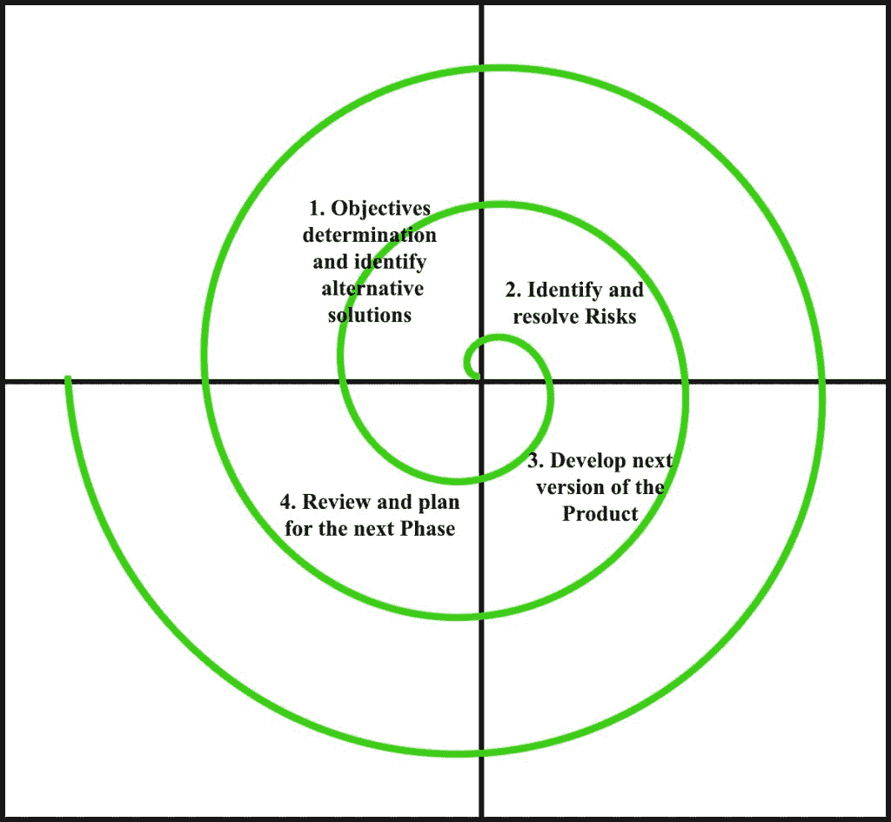

# 软件工程|螺旋模型

> 原文:[https://www . geesforgeks . org/software-engineering-spiral-model/](https://www.geeksforgeeks.org/software-engineering-spiral-model/)

**螺旋模型**是最重要的软件开发生命周期模型之一，为**风险处理**提供支持。在其图解表示中，它看起来像一个有许多环的螺旋。螺旋的确切循环数未知，并且可能因项目而异。螺旋的每个循环被称为软件开发过程的一个**阶段。**项目经理可以根据项目风险改变开发产品所需的确切阶段数。由于项目经理动态地确定阶段的数量，因此项目经理在使用螺旋模型开发产品时具有重要的作用。

任意点的螺旋半径代表项目迄今为止的费用(成本)，角度维度代表当前阶段迄今为止取得的进展。

**下图显示了螺旋模型的不同阶段:–**

螺旋模型的每个阶段被分成四个象限，如上图所示。下面将讨论这四个象限的功能-

1.  **目标确定和确定替代解决方案:**从客户那里收集需求，并在每个阶段开始时确定、阐述和分析目标。然后在该象限中提出该阶段可能的替代解决方案。
2.  **识别并解决风险:**在第二象限期间，评估所有可能的解决方案，以选择最佳可能的解决方案。然后确定与该解决方案相关的风险，并使用最佳策略解决风险。在这个象限的最后，原型是为可能的最佳解决方案而构建的。
3.  **开发产品的下一个版本:**在第三象限期间，通过测试开发并验证已识别的特性。第三象限结束时，软件的下一个版本可用。
4.  **审查和计划下一阶段:**在第四象限，客户评估软件的迄今开发版本。最终，下一阶段的计划开始了。

**螺旋模型中的风险处理**
风险是可能影响软件项目成功完成的任何不利情况。螺旋模型最重要的特点是在项目启动后处理这些未知风险。通过开发原型，这样的风险解决方案更容易实现。螺旋模型通过在软件开发的每个阶段提供构建原型的范围来支持风险复制。

[**原型模型**](https://www.geeksforgeeks.org/software-engineering-prototyping-model/) 也支持风险处理，但风险必须在项目开发工作开始前完全识别。但是在现实生活中，项目风险可能发生在开发工作开始之后，在这种情况下，我们不能使用原型模型。在螺旋模型的每个阶段，产品的特征被确定和分析，并且在那个时间点的风险被识别和通过原型解决。因此，与其他 SDLC 模型相比，该模型更加灵活。

**螺旋模型为什么叫元模型？**
螺旋模型被称为元模型，因为它包含了所有其他的 SDLC 模型。例如，单循环螺旋实际上代表了[迭代瀑布模型](https://www.geeksforgeeks.org/software-engineering-iterative-waterfall-model/)。螺旋模型结合了[经典瀑布模型](https://www.geeksforgeeks.org/software-engineering-classical-waterfall-model/)的分步方法。螺旋模型使用**原型模型**的方法，在每个阶段的开始建立一个原型作为风险处理技术。此外，螺旋模型可以被认为是支持进化模型的——沿着螺旋的迭代可以被认为是进化水平，通过进化水平构建完整的系统。

**螺旋模型的优势** :
下面是螺旋模型的一些优势。

1.  **风险处理:**随着开发的进行，出现了很多未知风险的项目，在这种情况下，由于每个阶段都有风险分析和风险处理，螺旋模型是最好遵循的开发模型。
2.  **适合大型项目:**大型复杂项目建议使用螺旋模型。
3.  **需求中的灵活性:**后期需求中的变更请求可以通过使用该模型准确地纳入。
4.  **客户满意度:**客户可以在软件开发的早期阶段看到产品的开发，因此，在整个产品完成之前，他们已经习惯了使用该系统。

**螺旋模型的缺点** :
下面是螺旋模型的一些主要缺点。

1.  **复杂:**螺旋模型比其他 SDLC 模型复杂得多。
2.  **贵:**螺旋模型不适合小项目，因为贵。
3.  **过于依赖风险分析:**项目的成功完成非常依赖于风险分析。没有非常有经验的专家，使用这个模型开发一个项目将是失败的。
4.  **时间管理难度:**由于项目开始时阶段数未知，所以时间估算非常困难。