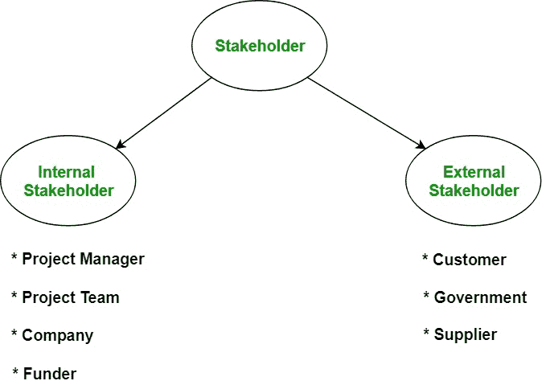

# 软件工程|利益相关方

> 原文:[https://www . geesforgeks . org/software-engineering-涉众/](https://www.geeksforgeeks.org/software-engineering-stakeholder/)

简单地说，任何在项目中有任何关系/兴趣的人都被称为利益相关者。术语**软件项目涉众**是指“直接或间接参与项目并可能影响或受到项目结果影响的个人、团体或公司”。

**什么是利益相关者识别？**
它是识别能够影响或被软件项目的决策、活动或结果影响的个人、团体或公司的过程。重要的是要确定项目的确切要求以及各种利益相关者对项目结果的期望。

利益相关者类型:

**1。内部利益相关者:**
内部利益相关者是指直接参与项目的个人、团体或公司。
例如

1.  **项目经理:**
    负责管理整个项目。项目经理通常从不参与最终产品的生产，但他/她控制、监督和管理生产中涉及的活动。
2.  **项目组:**
    在项目经理的领导下执行项目的实际工作，包括开发、测试等。
3.  **公司:**
    参与项目的组织，其员工直接参与项目的开发。
4.  **出资方:**
    为项目的顺利完成提供资金和资源。

**2。外部利益相关者:**
外部利益相关者是指与项目间接相关，但对项目的成功完成有重大贡献的人。
例如

1.  **客户:**
    指定项目的需求，并在需求收集阶段的启发过程中提供帮助。客户是正在为其开发项目的人。
2.  **供应商:**
    为项目提供必要的服务和设备。
3.  **政府:**
    制定有助于组织更好运转的政策。