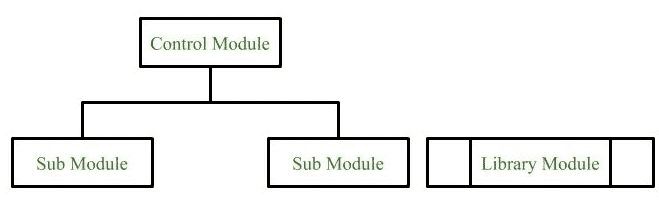
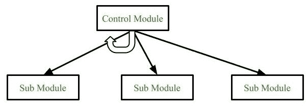
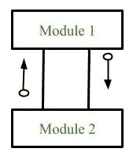
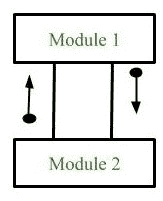
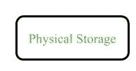
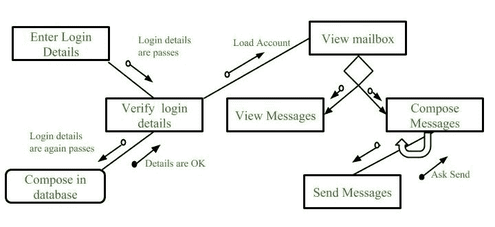

# 软件工程|结构图

> 原文:[https://www . geesforgeks . org/software-engineering-structure-charts/](https://www.geeksforgeeks.org/software-engineering-structure-charts/)

**结构图**表示模块的层次结构。它将整个系统分解为最底层的功能模块，更详细地描述了系统每个模块的功能和子功能。结构图将系统划分为黑盒(用户知道系统的功能，但不知道内部细节)。输入被提供给黑盒并产生适当的输出。

顶层的模块称为底层模块。组件从上到下、从左到右读取。当一个模块调用另一个模块时，它将被调用的模块视为黑盒，传递所需的参数并接收结果。

**结构化图表构造中使用的符号**

1.  **模块**
    它代表系统的过程或任务。它有三种类型。

*   **控制模块**
    一个控制模块分支到多个子模块。
*   **子模块**
    子模块是另一个模块的一部分(子模块)。
*   **库模块**
    库模块可重用，可从任何模块调用。

*   **Conditional Call**
    It represents that control module can select any of the sub module on the basis of some condition.

    

    *   **Loop (Repetitive call of module)**
    It represents the repetitive execution of module by the sub module.
    A curved arrow represents loop in the module.

    

    模块的循环重复执行覆盖了所有的子模块。

    *   **Data Flow**
    It represents the flow of data between the modules. It is represented by directed arrow with empty circle at the end.

    

    *   **Control Flow**
    It represents the flow of control between the modules. It is represented by directed arrow with filled circle at the end.

    

    *   **Physical Storage**
    Physical Storage is that where all the information are to be stored.

    

    **示例:电子邮件服务器的结构图**

    

    **结构图类型:**

    1.  **以转换为中心的结构化:**
        这些类型的结构图是为接收输入的系统设计的，该输入由一个模块执行的一系列操作进行转换。
    2.  **以交易为中心的结构:**
        这些结构描述了一个处理许多不同类型交易的系统。