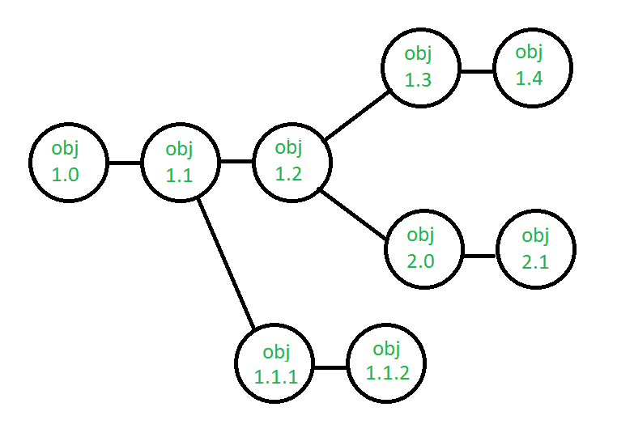

# 软件工程|系统配置管理

> 原文:[https://www . geesforgeks . org/software-engineering-system-configuration-management/](https://www.geeksforgeeks.org/software-engineering-system-configuration-management/)

每当构建一个软件时，总是有改进的空间，这些改进会带来画面上的变化。可能需要进行更改来修改或更新任何现有的解决方案，或者为问题创建新的解决方案。需求每天都在变化，因此我们需要根据当前的需求升级我们的系统，以满足期望的输出。在对现有系统进行更改之前，应对其进行分析，在实施之前进行记录，报告前后的详细信息，并以提高质量和减少错误的方式进行控制。这就是系统配置管理的需求所在。

**系统配置管理(SCM)** 是一种练习安排，通过识别变更项目、建立这些项目之间的联系、制作/描述用于监督不同变体的工具、控制当前框架中正在执行的变更、检查和揭示/报告所做的变更来控制变更。根据以下事实来控制变更是很重要的:如果变更没有被合法地检查，那么它们可能会破坏一个运行良好的程序。这样，供应链管理是所有项目管理活动的一个基本部分。

**供应链管理中涉及的流程–**
配置管理为工作产品的顺利控制提供了一个规范的环境。它涉及以下活动:

1.  **识别和建立–**从在给定时间点组成基线的产品中识别配置项(基线是一组相互一致的配置项，已经过正式审查和同意，并作为进一步开发的基础)。建立项目之间的关系，为变更管理系统创建管理多级控制和程序的机制。
2.  **Version control –** Creating versions/specifications of the existing product to build new products from the help of SCM system. A description of version is given below:

    

    假设经过一些更改，配置对象的版本从 1.0 更改为 1.1。微小的修正和改变导致版本 1.1.1 和 1.1.2，随后是主要的更新，即对象 1.2。对象 1.0 的发展一直延续到 1.3 和 1.4，但是最后，对象的一个值得注意的变化导致了一个新的进化路径，版本 2.0。这两个版本目前都受支持。

3.  **Change control –** Controlling changes to Configuration items (CI). The change control process is explained in Figure below:

    

    提交并评估变更请求，以评估技术价值、潜在的副作用、对其他配置对象和系统功能的总体影响以及变更的预计成本。评估结果以变更报告的形式呈现，由变更控制委员会(CCB)使用，CCB 是对变更的状态和优先级做出最终决定的个人或团体。为每个批准的变更生成一个工程变更请求。

    如果变更因正当理由被拒绝，建行也会通知开发商。ECR 描述了要进行的变更、必须遵守的限制以及审查和审计的标准。要更改的对象从项目数据库中“签出”，进行更改，然后再次测试该对象。然后将对象“签入”数据库，并使用适当的版本控制机制来创建软件的下一个版本。

4.  **配置审核–**软件配置审核是对过程和产品的正式技术审查的补充。它侧重于已修改的配置对象的技术正确性。审核确认供应链管理系统中项目的完整性、正确性和一致性，并跟踪从审核到结束的行动项目。
5.  **Reporting –** Providing accurate status and current configuration data to developers, tester, end users, customers and stakeholders through admin guides, user guides, FAQs, Release notes, Memos, Installation Guide, Configuration guide etc .

    **SCM Tools–**
    市场上有不同的工具可供 SCM 使用，如:CFEngine、Bcfg2 服务器、fleeg、SmartFrog、CLEAR CASETOOL (CC)、SaltStack、CLEAR QUEST TOOL、Puppet、SVN- Subversion、Perforce、TortoiseSVN、IBM Rational 团队音乐会、IBM Configuration management 版本管理、Razor、Ansible 等。名单上还有很多。

    建议在选择任何配置管理工具之前，对其功能有一个正确的理解，选择最适合您项目需求的工具，并在选择使用之前清楚每种工具的优缺点。