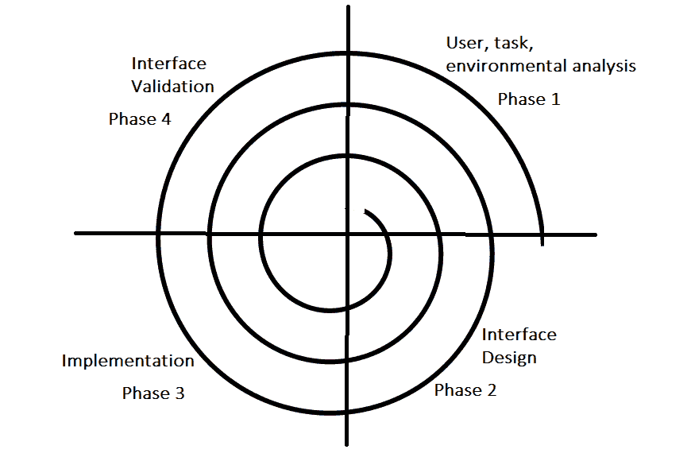

# 软件工程|用户界面设计

> 原文:[https://www . geesforgeks . org/software-engineering-user-interface-design/](https://www.geeksforgeeks.org/software-engineering-user-interface-design/)

用户界面是用户为了使用软件而与之交互的前端应用程序视图。如果软件的用户界面是:

*   有魅力的
*   简单易用
*   短时间内响应迅速
*   清晰易懂
*   在所有界面屏幕上保持一致

有两种类型的用户界面:

1.  **命令行界面:**命令行界面提供了一个命令提示符，用户在这里输入命令并反馈给系统。用户需要记住命令的语法及其用法。
2.  **图形用户界面:**图形用户界面提供与系统交互的简单交互界面。图形用户界面可以是硬件和软件的结合。使用图形用户界面，用户解释软件。

**用户界面设计流程:**

用户界面的分析和设计过程是迭代的，可以用螺旋模型来表示。用户界面的分析和设计过程由四个框架活动组成。

1.  **用户、任务、环境分析和建模:**最初，重点是基于将与系统交互的用户的简介，即理解、技能和知识、用户类型等，基于用户的简介将用户分成类别。从每个类别中收集需求。根据需求，开发人员了解如何开发接口。一旦收集了所有的需求，就会进行详细的分析。在分析部分，确定、描述和阐述了用户为建立系统目标而执行的任务。对用户环境的分析侧重于物理工作环境。要问的问题包括:
    *   接口将位于物理上的什么位置？
    *   用户是否会坐着、站着或执行其他与界面无关的任务？
    *   接口硬件是否适应空间、光线或噪音限制？
    *   是否有环境因素驱动的特殊人为因素考虑？
2.  **界面设计:**这个阶段的目标是定义一组界面对象和动作，即使用户能够执行所需任务的控制机制。指出这些控制机制如何影响系统。指定任务和子任务的操作顺序，也称为用户场景。指示用户执行特定任务时的系统状态。始终遵循西奥·曼德尔提出的三条黄金法则。随着设计模型的细化，诸如响应时间、命令和动作结构、错误处理和帮助工具等设计问题也被考虑在内。这个阶段是实施阶段的基础。
3.  **接口构建和实现:**实现活动从创建原型(模型)开始，原型(模型)能够评估使用场景。随着迭代设计过程的继续，允许创建窗口、菜单、设备交互、错误消息、命令和交互环境的许多其他元素的用户界面工具包可以用于完成界面的构建。
4.  **接口验证:**此阶段重点测试接口。接口应该能够正确执行任务，并且能够处理各种任务。它应该满足用户的所有要求。它应该易于使用和学习。用户应该接受这个界面在他们的工作中是有用的。

**黄金法则:**

以下是西奥·曼德尔提出的黄金法则，在界面设计过程中必须遵守。

**将用户置于控制中:**

*   以不强迫用户进行不必要或不希望的动作的方式定义交互模式:用户应该能够轻而易举地进入和退出该模式。
*   提供灵活的交互:不同的人会使用不同的交互机制，有些人可能会使用键盘命令，有些人可能会使用鼠标，有些人可能会使用触摸屏等，因此应该提供所有的交互机制。
*   允许用户交互是可中断和可撤销的:当用户正在执行一系列操作时，用户必须能够中断该序列来执行一些其他工作，而不会丢失已经完成的工作。用户还应该能够进行撤销操作。
*   随着技能水平的提高简化交互，并允许定制交互:高级或高技能用户应该有机会根据用户的需要定制界面，这允许不同的交互机制，以便用户在使用相同的交互机制时不会感到无聊。
*   对临时用户隐藏技术内部:用户不应该知道系统的内部技术细节。他应该与界面交互，只是为了完成他的工作。
*   为与屏幕上出现的对象直接交互而设计:用户应该能够使用这些对象并操纵屏幕上出现的对象来执行必要的任务。这样，用户感觉很容易控制屏幕。

**降低用户的内存负荷:**

*   减少对短时记忆的需求:当用户参与一些复杂的任务时，对短时记忆的需求很大。因此，在给定输入和结果的情况下，界面的设计应该减少对以前做过的动作的记忆。
*   建立有意义的默认设置:总是应该向普通用户提供初始的默认设置，如果用户需要添加一些新的功能，那么他应该能够添加所需的功能。
*   定义直观的快捷键:用户应该使用助记符。助记符是指在屏幕上做一些动作的键盘快捷键。
*   界面的视觉布局应该基于现实世界的隐喻:你在屏幕上所代表的任何东西，如果它是现实世界实体的隐喻，那么用户将很容易理解。
*   以渐进的方式公开信息:界面应该分层组织，即在主屏幕上，关于任务、对象或某些行为的信息应该首先在高抽象层次上呈现。在用户用鼠标点击表示感兴趣之后，应该呈现更多的细节。

**使界面一致:**

*   允许用户将当前任务放入有意义的上下文中:许多界面有几十个屏幕。因此，始终如一地提供指标非常重要，这样用户就可以知道正在做的工作。用户还应该知道从哪个页面导航到当前页面，以及从当前页面可以导航到哪里。
*   保持一系列应用程序的一致性:一些应用程序的开发都应该遵循和实现相同的设计、规则，以便在应用程序之间保持一致性。
*   如果过去的交互模型已经创造了用户期望，除非有令人信服的理由，否则不要做出改变。