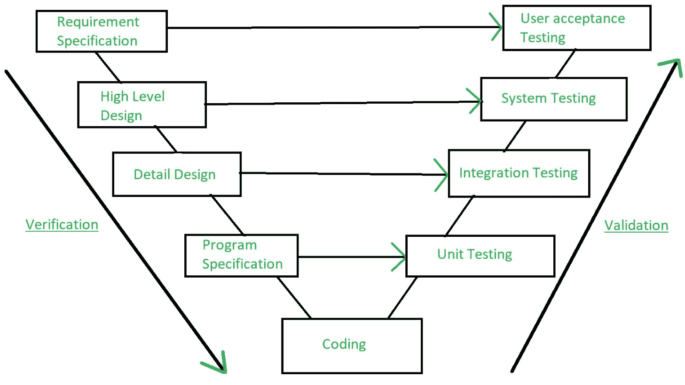

# 软件工程|验证和确认

> 原文:[https://www . geesforgeks . org/software-engineering-verification-and-validation/](https://www.geeksforgeeks.org/software-engineering-verification-and-validation/)

验证和确认是调查一个软件系统是否满足规范和标准以及它是否满足要求的目的的过程。**巴里·博姆**对验证和确认的描述如下:

> **验证:**我们打造的产品对吗？
> **验证:**我们生产的产品是否合适？

**验证:**
验证是检查一个软件是否没有任何 bug 就实现了目标的过程。是保证开发的产品是否正确的过程。它验证开发的产品是否满足我们的要求。
验证为**静态测试**。

核查涉及的活动:

1.  检查
2.  复习
3.  演练
4.  案头检查

**验证:**
验证是检查软件产品是否达标或者换句话说产品是否有高水平要求的过程。这是检查产品验证的过程，即检查我们正在开发的产品是否是正确的产品。它是对实际和预期产品的验证。
验证是**动态测试**。

验证中涉及的活动:

1.  黑盒测试
2.  白盒测试
3.  单元测试
4.  集成测试

**注意:**验证之后是验证。

