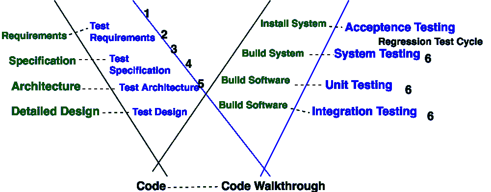

# 软件工程| W-模型

> 原文:[https://www.geeksforgeeks.org/software-engineering-w-model/](https://www.geeksforgeeks.org/software-engineering-w-model/)

**保罗·赫兹里奇**在 1993 年推出了 **W 型**。

**W-model** 是我们在软件开发过程开始的同时开始真正的测试活动的最新软件开发模型。其中 as 软件开发过程是一种方法，在最终软件或产品交付之前，通过规划、开发和测试的各个阶段来制作软件或产品。测试是这样一个阶段，对于确保交付最佳质量的产品至关重要。

*   v 模型和 W 模型是软件测试中最重要的两种模型。*   W-Model 涵盖了 V-Model 跳过的那些活动，也处理了 V-Model 无法捕捉到的问题。*   W-Model 方法试图解决和解决缺点。*   W-model 只能在产品开发完成后进行，中间不需要修改。这种类型的测试最适合短期项目。*   With the help of W-Model, we ensure that the testing of the product starts from the very first day of the inception of product and each phase of the product development is verified and validated.

    

    **W-Model 的阶段:**
    每个阶段都经过验证/确认。虚线表示绿色的每个阶段都通过天蓝色的每个阶段进行验证/测试。在上图中，

    *   第 1 点指的是——构建测试计划和测试策略。
    *   第 2 点指的是场景识别。
    *   第 3 点指的是——从规范文件和设计文件中准备测试用例。
    *   第 4 点指的是——从规范文件和设计文件中准备测试用例。
    *   第 5 点指的是——审查测试用例，并根据审查意见进行更新。
    *   第 6 点是指–各种测试方法，如单元/集成测试、路径测试、等价划分、边界值、基于规范的测试、安全性测试、可用性测试、性能测试。
    *   After this, there are regression test cycles and then User acceptance testing.

        **Testing Techniques Used in W-Model:**
        1.  回归测试
        2.  静态测试:
            静态测试进一步分为两部分:
            *   **(一)**回顾
            *   **(b)** 静态分析
        3.  动态试验

        **W-Model 优势:**

        *   在 W 模型中，左侧的建设性任务和右侧的破坏性任务之间没有严格的划分。
        *   在测试阶段，开发人员负责缺陷的消除和实施的修正。
        *   强调测试不仅仅是测试用例的构建、执行和评估。
        *   测试的重要性和测试的单个活动的顺序是清楚的。

        **W-Model 的劣势:**

        *   真实的事实在这个模型中被简化了。
        *   如果所有参与项目的人都要接受它，就需要一个简单的模型。
        *   对于高度关键的应用程序，测试活动当然具有更高的权重，或者至少与其他活动具有相同的权重。