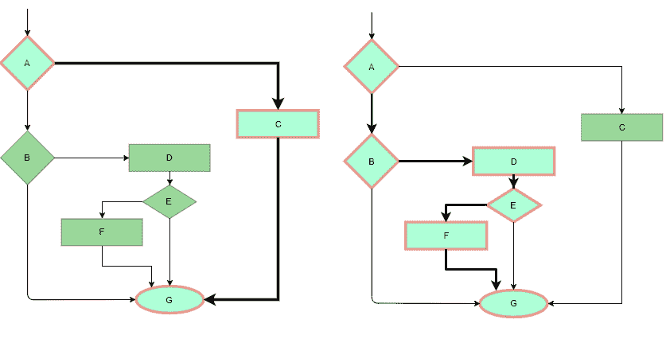
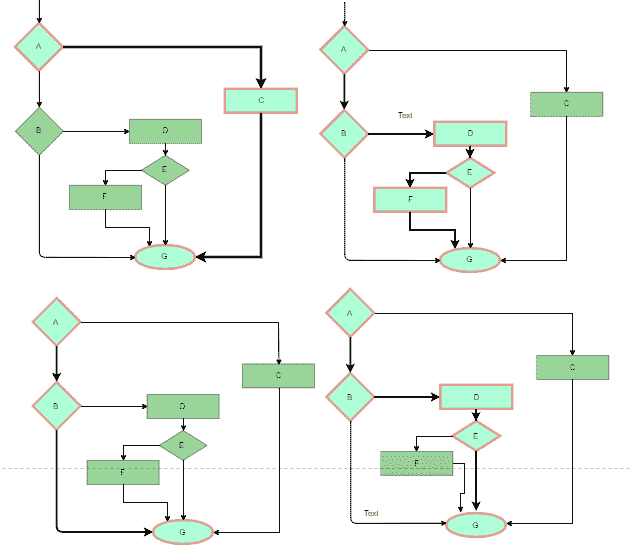
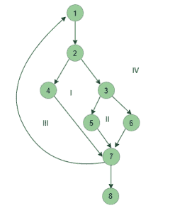

# 软件工程|白盒测试

> 原文:[https://www . geesforgeks . org/software-engineering-white-box-testing/](https://www.geeksforgeeks.org/software-engineering-white-box-testing/)

先决条件–[软件测试|基础知识](https://www.geeksforgeeks.org/software-testing-basics/)

白盒测试技术分析内部结构所使用的数据结构、内部设计、代码结构和软件的工作，而不仅仅是黑盒测试中的功能。也称为玻璃箱测试或透明箱测试或结构测试。

**白盒测试工作流程:**

*   **输入:**需求、功能规范、设计文档、源代码。
*   **处理:**进行风险分析，指导整个流程。
*   **适当的测试规划:**设计测试用例，以覆盖整个代码。执行冲洗-重复，直到达到无错误软件。此外，还会传达结果。
*   **输出:**准备整个测试过程的最终报告。

**测试技术:**

*   **语句覆盖:**在这种技术中，目标是遍历所有语句至少一次。因此，每一行代码都经过测试。在流程图的情况下，每个节点必须至少遍历一次。由于涵盖了所有代码行，有助于指出错误代码。
    

    语句覆盖示例

*   **分支覆盖:**在这种技术中，测试用例被设计为来自所有决策点的每个分支至少被遍历一次。在流程图中，所有边必须至少遍历一次。
    

    需要四个测试用例,以便覆盖所有决策的所有分支,即覆盖流程图的所有边

*   **Condition Coverage:** In this technique, all individual conditions must be covered as shown in the following example:
    1.  读取 X，Y
    2.  IF(X == 0 || Y == 0)
    3.  打印“0”

    在这个例子中，有两个条件:X == 0 和 Y == 0。现在，测试这些条件得到真和假作为它们的值。一个可能的例子是:

    *   # TC1–X = 0，Y = 55
    *   # TC2–X = 5，Y = 0
*   **Multiple Condition Coverage:** In this technique, all the possible combinations of the possible outcomes of conditions are tested at least once. Let’s consider the following example:
    1.  读取 X，Y
    2.  IF(X == 0 || Y == 0)
    3.  打印“0”
    *   #TC1: X = 0，Y = 0
    *   #TC2: X = 0，Y = 5
    *   #TC3: X = 55，Y = 0
    *   #TC4: X = 55，Y = 5

    因此，两个单独的条件需要四个测试用例。
    同样，如果有 n 个条件，那么将需要 2 个 n 个测试用例。

*   **Basis Path Testing:** In this technique, control flow graphs are made from code or flowchart and then Cyclomatic complexity is calculated which defines the number of independent paths so that the minimal number of test cases can be designed for each independent path.
    **Steps:**
    1.  制作相应的控制流程图
    2.  计算圈复杂度
    3.  找到独立的路径
    4.  设计对应于每个独立路径的测试用例

    **流程图符号:**是由节点和边组成的有向图。每个节点代表一系列语句或一个决策点。谓词节点是表示决策点的节点，该决策点包含一个条件，在该条件之后图形会拆分。区域由节点和边界定。
    T3】

    **圈复杂度:**它是软件逻辑复杂度的度量，用于定义独立路径的数量。对于图 G，V(G)是它的圈复杂度。
    计算 V(G):

    1.  V(G) = P + 1，其中 P 是流程图中谓词节点的数量
    2.  v(G)= E–N+2，其中 E 为边数，N 为节点总数
    3.  V(G) =图中非重叠区域的数量

    **示例:**
    
    V(G) = 4(使用以上任何公式)
    独立路径数= 4

    *   # P1:1–2–4–7–8
    *   # P2:1–2–3–5–7–8
    *   # P3:1–2–3–6–7–8
    *   # P4:1–2–4–7–1–。。。– 7 – 8
*   **循环测试:**循环被广泛使用，这些是许多算法的基础，因此，它们的测试非常重要。错误经常发生在循环的开始和结束。
    1.  **简单循环:**对于大小为 n 的简单循环，测试用例被设计为:
        *   完全跳过循环
        *   只有一次通过循环
        *   2 张通行证
        *   m 次通过，其中 m < n
        *   n-1 年 n+1 通路
    2.  **嵌套循环:**对于嵌套循环，所有循环都设置为最小计数，我们从最里面的循环开始。对最里面的循环进行简单的循环测试，并向外进行，直到所有循环都经过测试。
    3.  **串联循环:**独立循环，一个接一个。简单的循环测试适用于每一个。
        如果它们不独立，就像筑巢一样对待它们。

**优势:**

1.  白盒测试非常彻底，因为整个代码和结构都经过测试。
2.  它可以优化代码删除错误，并有助于删除额外的代码行。
3.  它可以在早期阶段开始，因为它不需要任何接口，就像黑盒测试一样。
4.  易于自动化。

**缺点:**

1.  主要缺点是很贵。
2.  重新设计代码和重写代码需要重新编写测试用例。
3.  与黑盒测试相反，测试人员需要对代码和编程语言有深入的了解。
4.  在测试现有代码时，无法检测到缺失的功能。
5.  非常复杂，有时不现实。