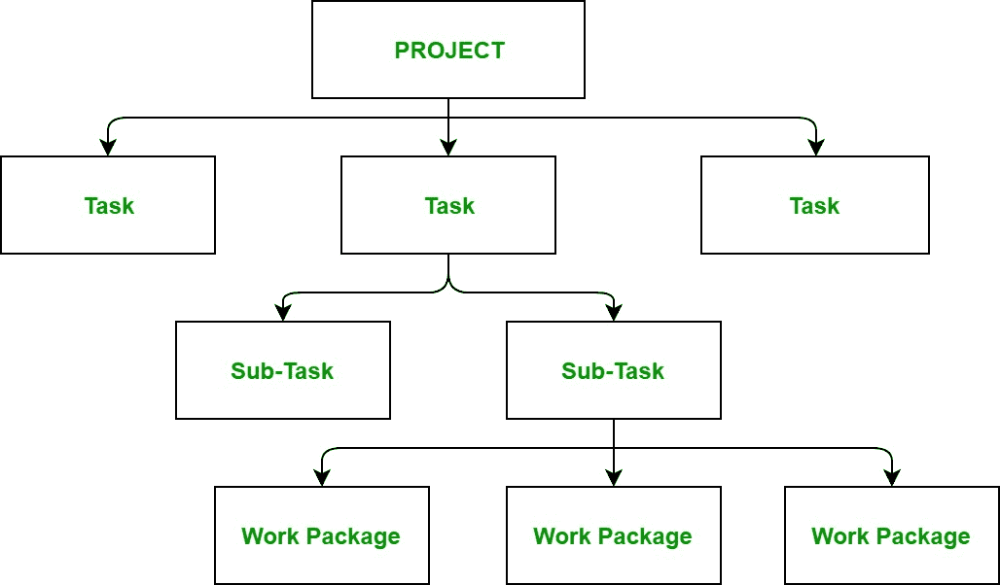

# 软件工程|工作分解结构

> 原文:[https://www . geesforgeks . org/软件-工程-工作-分解-结构/](https://www.geeksforgeeks.org/software-engineering-work-breakdown-structure/)

一个**工作分解结构**包括将一个大而复杂的项目划分为更简单、可管理和独立的任务。此树(结构)的根由项目名称本身标记。为了构建一个工作分解结构，每个节点被递归地分解成更小的子活动，直到在叶子级别，活动变得不可分割和独立。它遵循自上而下的方法。

**步骤:**

*   **步骤 1:** 确定项目的主要活动。
*   **步骤 2:** 识别主要活动的子活动。
*   **第三步:**重复，直到创造出不可分割的、简单的、独立的活动。

**工作分解结构的构建:**
首先，项目经理和最高管理层确定项目的主要可交付成果。在这个重要的步骤之后，这些主要的可交付成果被分解成更小的更高级的任务，并且这个完整的过程被递归地完成以产生更小的独立任务。这取决于项目经理和团队在多大程度上希望分解他们的项目。

一般来说，最低级的任务是最简单和独立的任务，需要不到两周的时间。因此，没有规则规定我们可以建立项目的工作分解结构到哪一个级别，因为这完全取决于我们正在进行的项目类型和公司的管理。整个项目的效率和成功主要取决于项目的工作分解结构的质量，因此，它意味着它的重要性。

**用途:**

*   它允许对每项活动进行精确的成本估算。
*   它可以更精确地估计每项活动所需的时间。
*   它使项目的管理变得容易。
*   这有助于高层管理人员对项目进行适当的组织。