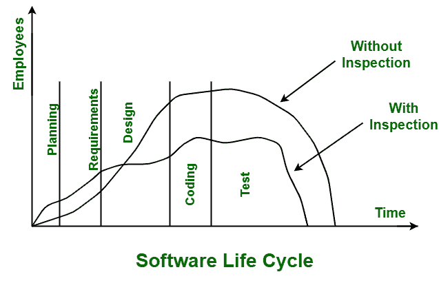

# 软件检查参与者

> 原文:[https://www . geesforgeks . org/software-inspection-participants/](https://www.geeksforgeeks.org/software-inspection-participants/)

[软件检查](https://www.geeksforgeeks.org/how-software-inspection-improves-software-quality/)一般是一个完全建立并被证实的活动。它是由迈克尔·法甘(1970 年代)引进和发展的。

它被设计成一个精心设计的过程，仅仅是为了对[软件工件](https://www.geeksforgeeks.org/artifact-software-development/)进行系统的回顾。这也是一个识别和检测正在开发的[软件产品](https://www.geeksforgeeks.org/software-engineering-software-product/)中的缺陷、错误、违反开发标准以及任何其他缺陷的过程。它还确保软件产品是否满足客户的要求。

**带检查的软件**生命周期提高产品质量，节约资金和资源，减少整体开发时间等。软件检查通常由一组人或参与者来执行。参与者的人数从最少三人到最多六人不等。要求的角色被分配给检查活动中的每个个人或参与者。每个参与者至少被分配一个角色；但是，参与者可以扮演多个角色。不同参与者的不同角色如下:

1.  **Moderator :**
    Moderator is generally leader i.e. Senior technical member of inspection activity. It simply schedules and conducts meeting. They are basically in charge of process. Moderator is basically responsible for planning, controlling inspection as well as coordinating it and keeping group focused on the purpose of meeting i.e. to identify deficiencies but not fixing it. Moderator also ensures that whether item or product that is needed to be inspected successfully fulfills entry criteria for inspection readiness or not.

    他们还确保团队不会偏离/偏离主题，坚持一个时间表。主持人基本上是一个有经验的人，他确切地知道如何让参与者保持技术上的强大，以及如何让参与者远离自相残杀的社交技能。

2.  **Author :**
    Author simply develops, creates, and maintains or handles work product that is needed to be inspected. In inspection activity or process, Author is basically considered as a passive participant. He can answer any questions when asked, but he is not allowed and permitted to provide full explanation or defend code. In simple words, they are allowed to answer questions being asked about product during inspection to help other people in understanding work, but they are not allowed to defend his or her work.

    作者的角色可以分配给负责开发和生产被检查程序的程序员或设计师。他们还负责解决和修复检查过程中可能出现的任何缺陷。

3.  **Reader :**
    Reader or Testers simply reads work product to team as they proceed through inspection. Their main work is to read code and find out any defect if present. This role of a reader is usually simple but not insignificant. They generally present code or document at an inspection meeting where they simply read document one at a time.

    简单来说，读者是检查会议中负责带领检查小组通过工作产品参与者。除了工作产品中使用的词语之外，他们还试图通过各种词语的帮助，尽可能以更清晰易懂的方式向参与者解释每个部分的功能。

4.  **记录器:**
    记录器或抄写员只是记录缺陷、不足或检查过程或活动中可能出现的任何其他问题。他们主要关注在检查会议期间提供潜在缺陷的日志。只要在被检查的文件中发现任何问题，读者只需以书面形式描述和解释缺陷。然后，为了更好地理解，这些缺陷由记录器分类。
5.  **Inspector :**
    Inspector simply tries to determine and identify errors in work product as reader reads work product. They are generally responsible for improvements that are related to inspection process, standards development, checklist updating, etc. They also raise questions, suggest problems, and criticize document.

    他们也不被允许攻击作者或文档，而是应该是客观的建设性的。检查员基本上是识别和检测错误的熟练人员，因为他知道可能存在缺陷的批评和角落。检查员可能包括来自不同专业领域的人员，如市场营销、质量保证、质量控制等。，每个人带来不同的观点。