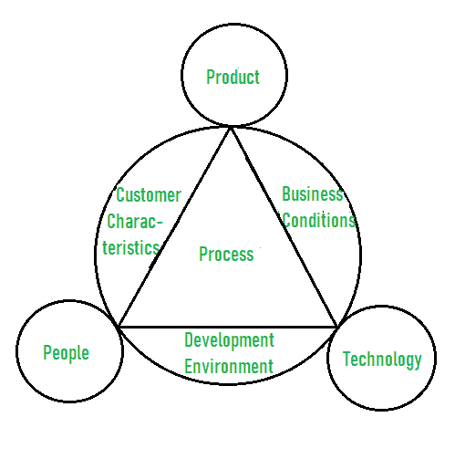

# 软件流程定制与改进

> 原文:[https://www . geesforgeks . org/software-process-customization-and-improvement/](https://www.geeksforgeeks.org/software-process-customization-and-improvement/)

软件过程，也称为**软件开发过程或软件开发生命周期(SDLC)** 是简单地将软件过程划分为一组导致软件生产或开发的活动或阶段。这些活动包括设计、实施、修改、测试、维护等。

执行这些活动是为了改进项目的设计和管理。软件过程定制和改进也是为了改进整个开发过程而执行的一些技术或活动。
让我们了解这两种技术:

<figure class="table">

| 软件过程定制 | 软件过程改进 |
| 它是为一组特定用户设计、开发、部署甚至维护软件的过程。 | 它被简单地定义为计划和实施所有改进活动所需执行的各种任务、工具和技术的顺序的定义。 |
| 它包括三个主要因素:人、产品和过程。 | 它包括三个因素:人、技术和产品。 |
| 它还包括应用定制、应用现代化和应用管理。 | 它还包括改进规划、实施、评估 |
| 它非常昂贵，需要详细的规划，并且非常耗时。 | 它降低了成本，通过安装工具提高了开发速度，减少了人工完成的时间和工作量，或者使生产过程自动化。 |
| 它提高了生产力水平。 | 它提高了产品质量。 |
| 它是为了满足用户的需求而创建的。 | 它的创建是为了实现特定的目标，如提高开发速度、实现更高的产品质量等。 |
| 它由内部开发团队或第三方创建。 | 它通过雇佣最优秀的人来提高团队绩效 |

</figure>