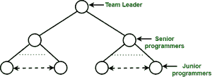

# 软件项目团队组织

> 原文:[https://www . geesforgeks . org/software-project-team-organization/](https://www.geeksforgeeks.org/software-project-team-organization/)

组织项目团队的方式有很多。一些重要的方式如下:

1.  分层团队组织
2.  首席程序员团队组织
3.  矩阵团队，组织
4.  无自我的团队组织
5.  民主团队组织

**层级团队组织:**
在这种情况下，不同层级的人的组织遵循树形结构。底层人员通常拥有关于系统的最详细的知识。更高层次的人对整个项目有更广泛的欣赏。

**层级团队组织的好处:**

*   它限制了通信路径的数量，并且仍然允许所需的通信。
*   它可以扩展到多个级别。
*   它非常适合分层软件产品的开发。
*   大型软件项目可能有几个层次。

**层级团队组织的局限性:**

*   由于信息必须向上传播，它可能会被扭曲。
*   等级制度中的等级经常从社会和经济角度来评判人们。
*   大多数有技术能力的程序员往往会被提升到管理职位，这可能会导致优秀的程序员和糟糕的经理的流失。

**首席程序员团队组织:**
该团队组织由以下团队成员组成的小团队组成:

*   **首席程序员:**是积极参与规划、规范和设计过程的人，理想情况下也是参与实施过程的人。
*   **项目助理:**是首席程序员最亲近的技术同事。
*   **项目秘书:**解除首席程序员和所有其他程序员的管理工具。
*   **专家:**这些人选择实现语言，实现单个系统组件，使用软件工具并执行任务。

**首席程序员团队组织优势:**

*   集中决策
*   减少通信路径
*   小团队比大团队更有效率
*   首席程序员直接参与系统开发，可以行使更好的控制功能。

**首席程序员团队组织的劣势:**

*   项目生存只靠一个人。
*   会引起心理问题，因为“首席程序员”就像“国王”拿走了所有的功劳，而其他成员对此愤愤不平。
*   团队组织仅限于小团队，小团队无法处理每个项目。
*   团队的有效性对首席程序员的技术和管理活动非常敏感。

**矩阵式团队组织:**
在矩阵式团队组织中，人员被划分为专家小组。每个小组都有一名经理。度量团队组织的示例如下:

**无自我团队组织:**
无自我编程是一种程序员应该将自己从产品中分离出来的心态。在这种团队组织中，目标被设定，决策由团队一致做出。在这个小组中，“领导”根据要执行的任务和成员的不同能力进行轮换。

在这个组织中，工作产品公开讨论，所有团队成员自由检查。如果团队由缺乏经验或不称职的成员组成，这种组织就有很大的风险。

**民主团队组织:**
与无我的团队组织颇为相似，但有一名成员是有一定职责的组长:

*   协调
*   无法达成共识的最终决定。

**民主团队组织优势:**

*   每个成员都可以为决策做出贡献。
*   成员可以互相学习。
*   工作满意度提高。

**民主团队组织的弊端:**

*   通信开销增加。
*   需要成员的兼容性。
*   更少的个人责任和权力。