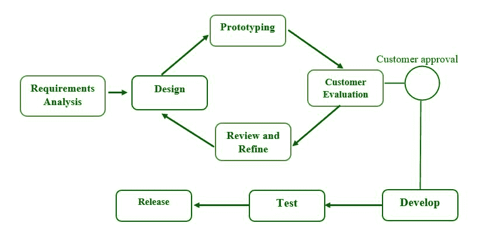

# 软件原型模型和阶段

> 原文:[https://www . geesforgeks . org/software-prototype-model-and-phases/](https://www.geeksforgeeks.org/software-prototyping-model-and-phases/)

**原型开发**是一种软件开发方法，它关注工作模型的使用，这些模型是基于最终用户的反馈而不断完善的。原型最常用于开发具有大量最终用户交互和复杂用户界面的系统。

因为它允许在开发的早期阶段捕获客户需求，所以软件原型作为软件开发模型变得越来越流行。它允许有价值的客户反馈，并帮助软件设计人员和开发人员了解销售的直接预期。

术语“软件原型”指的是创建软件应用程序原型的过程，该软件应用程序原型展示了正在开发的产品的功能，但可能不包含原始软件的确切逻辑。

**什么是软件原型？**

*   原型可以是功能有限的软件性能模型。
*   原型并不总是包含特定软件应用程序中使用的确切逻辑，而是在评估工作时需要考虑的额外工作。
*   原型设计用于允许用户在开发人员的建议被实现之前对其进行评估和测试。
*   它还有助于理解开发人员在产品设计过程中不会考虑的用户特定需求。

**原型模型阶段:**
原型模型有如下六个 SDLC 阶段

**步骤 1:需求收集和分析:**
需求分析是开发原型模型的第一步。在这个阶段，系统的需求被精确定义。在该方法中，系统用户被访问以确定他们对系统的期望。

**步骤 2:快速设计:**
第二阶段可能包括初步设计或快速设计。在这个阶段，系统的基本设计就形成了。然而，它不是一个完整的设计。它为用户提供了系统的快速概述。快速设计有助于原型的开发。

**步骤 3:构建原型:**
在这个阶段，实际的原型旨在支持从快速设计中获得的知识。它是所需系统的小型低级工作模型。

**步骤-4:初始用户评估:**
在此阶段，将建议的系统提交给客户进行初步测试。考察绩效模型的优缺点是有益的。收集客户反馈和建议，并转发给开发人员。

**第五步:提炼原型:**
如果用户对当前的模型不满意，你可能要改进响应用户反馈和建议的类型。当用户对升级后的模型满意时，基于批准的最终类型创建最终系统。

**第 6 步:实施产品和维护:**
最终系统经过全面测试，并在开发支持原版本后分发到生产中。为了减少停机时间和防止重大故障，程序员定期运行。

**原型模型的类型:**
四种类型的原型模型是:

1.  快速一次性原型
2.  进化原型
3.  增量原型
4.  极限原型

**1。快速一次性原型:**
初步要求用于快速一次性。它很快就被开发出来，以直观的方式显示需求是如何出现的。客户反馈有助于需求变化的运动，原型被重新创建，直到需求是基本的。因此，升级版本被拒绝，并且不能是最后接受的类型。该计划有助于测试想法和快速响应客户需求。

**2。进化原型:**
它帮助你避免时间和精力的浪费。这是因为从每种通信方法开始执行特定类型可能会很耗时。该模型对于涉及使用未知替代技术的项目非常有用。它也用于高端项目，其中每个特性必须只测试一次。当需求不稳定或在开始时没有被清楚地理解时，它是有用的。

**3。增量原型制作:**
最终产品被大量抽取成小原型，并在增量原型制作中单独开发。各种原型最终组合成一个产品。这种方法有助于减少用户和应用程序开发团队之间的反馈时间。

**4。极限原型法:**
极限原型法常用于网页开发。它分为三个阶段，必须按顺序完成。

1.  HTML 格式包含当前页面的基本原型。
2.  原型服务层将允许您模拟数据过程。
3.  服务被构建并集成到最终的原型中。

**软件原型应用:**
软件原型在需要高水平用户交互的系统开发中极为有益，例如在线应用。要求用户在处理数据之前填写表单或查看各种屏幕的系统可以从原型开发中受益匪浅，以便在软件开发之前就传达准确的外观和感觉。对于涉及大量信息处理的软件来说，原型开发通常不是一种选择，而且大部分功能都是内部的，几乎没有程序。原型开发可能是此类项目中的额外开销，并且需要大量的额外工作。

**软件原型的优势:**

*   用户帮助塑造未来。因此，错误可以在软件开发过程的第一阶段被发现。
*   原型制作也被认为是一种降低风险的功能，因为它可以看到不存在的性能，降低失败的风险。
*   协助团队成员有效沟通。
*   顾客满意是存在的，他从一开始就能感受到产品。
*   不会有软件丢失的风险。
*   快速的用户反馈有助于开发更好的软件解决方案。

**软件原型的缺点:**

*   原型制作是一个费时费力的过程。
*   制造特定类型废物的成本被完全浪费了，因为原型最终被丢弃了。
*   原型可能会导致过多的变更请求。
*   客户可能不愿意在很长一段时间内致力于迭代周期。
*   在每次客户测试期间，软件需求可能会有太多的变化。
*   由于客户需求的变化，文档记录不佳。