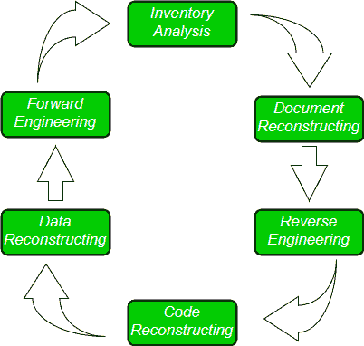

# 软件重新设计

> 原文:[https://www.geeksforgeeks.org/software-re-engineering/](https://www.geeksforgeeks.org/software-re-engineering/)

**软件重新设计**是对一个系统进行检查和修改，以一种新的形式重新构建它。当应用到软件开发过程中时，再工程的原理被称为软件再工程。它对软件成本、质量、客户服务和交付速度都有积极影响。在软件重新设计中，我们正在改进软件，使其更加高效和有效。

**<u>软件再工程的需求</u> :** 软件再工程是软件开发和产品质量提升的经济过程。这个过程使我们能够识别已部署资源的无用消耗和限制开发过程的约束，从而使开发过程变得更容易和更具成本效益(时间、财务、直接优势、优化代码、间接收益等)。)和可维护性。软件再造是必要的

**a) <u>提高生产率</u> :** 软件再造通过优化代码和数据库来提高生产率，从而加快处理速度。

**b) <u>持续的过程</u> :** 在测试或开发软件时，旧软件产品的功能仍然可以使用。

**c) <u>改进机会</u> :** 与此同时软件再造的过程中，不仅是软件的质量、特性和功能，还有你的技能被提炼，新的想法在你的脑海中袭来。这使得开发人员习惯于捕捉新的机会，以便开发越来越多的新功能。

**d) <u>降低风险</u> :** 开发人员不是从头或从开始阶段开发软件产品，而是从现有阶段开发产品，以增强利益相关者或其用户关注的某些特定功能。这种做法减少了出错的可能性。

**e) <u>节省时间</u> :** 如上所述，产品是从现有阶段而不是开始阶段开发的，因此在软件工程中消耗的时间较少。

**f) <u>优化</u> :** 该流程通过尽可能最大限度的一致优化，细化系统特性、功能，降低产品复杂度。

**重新设计成本因素:**

*   要重新设计的软件的质量。
*   工程工具支持可用性。
*   所需的数据转换范围。
*   重新设计的专家人员的可用性。

**软件重新设计活动:**

**1。库存分析:**
每个软件组织都应该有所有应用程序的库存。

*   清单只不过是一个包含信息的电子表格模型，这些信息提供了每个活动应用程序的详细描述。
*   通过根据业务关键度、寿命、当前可维护性和其他本地重要标准对这些信息进行排序，出现了重新设计的候选对象。
*   然后可以将资源分配给候选应用程序进行重新设计。

**2。文档重建:**
一个系统的文档要么解释它如何运行，要么解释如何使用它。

*   文档必须更新。
*   可能不需要完整记录应用程序。
*   该系统对业务至关重要，必须完全重新记录。

**3。逆向工程:**
逆向工程是一个设计恢复的过程。逆向工程工具从现有程序中提取数据、建筑和程序设计信息。

**4。代码重构:**

*   为了完成代码重构，使用重构工具分析源代码。记录结构化编程构造的违规，然后重构代码。
*   生成的重组代码经过审查和测试，以确保没有引入异常。

**5。数据重组:**

*   数据重组始于逆向工程活动。
*   剖析当前的数据架构，定义必要的数据模型。
*   识别数据对象和属性，并检查现有数据结构的质量。

**6。向前工程:**
向前工程也称为翻新或回收，不仅用于从现有软件中恢复设计信息，还用于改变或重建现有系统，以提高其整体质量。