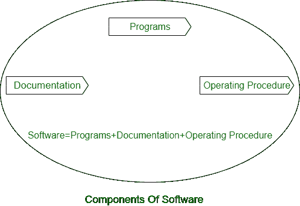
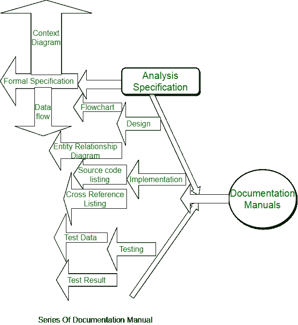
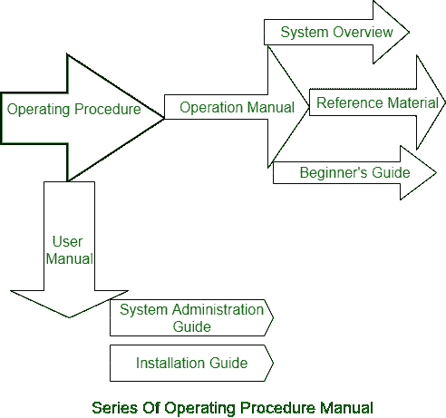

# 软件系统及其模型

> 原文:[https://www . geesforgeks . org/software-system-and-its-models/](https://www.geeksforgeeks.org/software-system-and-its-models/)

**软件系统:**
术语**编程**决定了 PC 项目、技术和相关报告(流程图、手册等)的安排，这些描述了程序以及如何利用它们。A **产品周期**是生产一个产品项目的练习安排和相关结果。编程工程师通常会完成这些练习。这是四个关键的循环练习，是所有产品测量的基础。这些练习是–

*   **软件确定:**产品的有用性和对其活性的要求应该被表征。
*   **软件转折:**应该创建满足前提条件的产品。
*   **软件审批:**产品要通过审批，保证做客户需要的事情。
*   **软件开发:**产品要提前满足不断变化的客户需求。

**软件系统模型:**
A **产品模型**是从特定角度引入的产品框架的预定含义。模型，就其趋势而言，是一种改进，因此产品框架模型是真实周期的反映，而真实周期正在被描绘。循环模型可能包含练习，这些练习对于产品框架、编程项目和参与编程设计的个人部分很重要。可能创建的编程框架模型的几个例子是–

*   **工作流模型–**
    这显示了流程中练习的安排以及它们的信息来源、产量和条件。这个模型中的练习执行人类活动。
*   **数据流或活动模型–**
    这将框架描述为一系列练习，每一个练习都会完成一些信息变化。它展示了对框架的贡献，例如，一个细节是如何转变成一个产出、一个计划的。这里的练习可能低于工作流程模型中的练习。他们可以执行由个人或个人电脑完成的更改。

*   **Role/Action Model –**
    This implies the parts of individuals associated with the product framework and the exercises for which they are capable of.

    编程进步有几种不同的通用模型或标准–

    *   **瀑布方法–**
        这将上述练习作为离散的框架阶段进行交付，例如，特定的先决条件、编程计划、执行、测试等。在每个阶段被描述之后，它被“关闭”并且前进到伴随的阶段。
    *   **进化发展–**
        这种技术交织了特殊、进步和认可的练习。一个基础框架很快就从一个极其概念性的细节演变而来。
    *   **形式转换–**
        这个策略依赖于交付一个正式的数字框架决定和改变这个特定的，利用数字技术到一个程序。这些变化是“正确的拯救”这意味着您可以确定创建的程序符合它们的细节。
    *   **可重用组件的系统组装–**
        这种技术接受目前存在的框架的各个部分。框架推进框架的目标是协调这些部分，而不是在没有任何准备的情况下创建它们。

    **软件压力:**

    *   **Size–**
        随着编程不断发展的不可预测性和欲望，编程变得越来越昂贵，越来越令人难以置信。例如，客户项目中的代码每隔几年就会增加一倍。

    *   **质量–**
    众多产品项目质量低下，即产品项目因测试策略不充分而在投入使用后弃用。例如，编程测试经常发现每 1000 行代码有 25 个错误。*   **成本–**
    编程改进过高，例如在创建时间和现金方面。例如，联邦航空局高级机械化框架的改进每行代码花费超过 700 美元。*   **Delayed Delivery –**
    Genuine timetable overwhelms are normal. Regularly the product sets aside more than the assessed effort to create, which thus prompts cost shooting up. For instance, one of every four huge scope advancement ventures is rarely finished.

    **编程 vs 程序:**
    编程不仅仅是程序。任何程序都是编程的一个子集，只要文档和工作系统手册准备好了，它就变成了编程。

    

    *   **程序:**程序是源代码和文章代码的混合。
    *   **Documentation** : Documentation comprises various kinds of manuals. Instances of documentation manuals are: Information Stream Graph, Stream Outlines, trauma center charts.

        

    *   **Operating Procedures :** Working Methods comprise directions to set up and utilize the product framework and guidelines on how to respond to the framework disappointment. Illustration of working framework methods manuals is establishment control, Fledgling’s aide, reference direct, framework organization manage, and so forth.

        