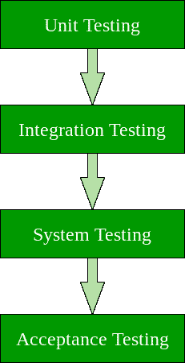

# 软件测试|基础知识

> 原文:[https://www.geeksforgeeks.org/software-testing-basics/](https://www.geeksforgeeks.org/software-testing-basics/)

软件测试可以被描述为验证和确认软件或应用程序没有错误、满足其设计和开发所指导的技术要求，并通过处理所有异常和边界情况有效地满足用户要求的过程。

软件测试的过程不仅旨在发现现有软件中的错误，还旨在找到在效率、准确性和可用性方面改进软件的措施。它主要旨在衡量软件程序或应用程序的规格、功能和性能。

**软件测试可以分为两个步骤:**
1。**验证:**是指确保软件正确实现特定功能的一组任务。

2.**验证:**它指的是一组不同的任务，确保已经构建的软件可追溯到客户需求。

**验证:**“我们造的产品对吗？”
**验证:**“我们生产的产品合适吗？”

**有哪些不同类型的软件测试？**

软件测试可以大致分为两种类型:

1.**手动测试:**手动测试包括手动测试软件，即不使用任何自动化工具或任何脚本。在这种类型中，测试人员接管最终用户的角色，并测试软件以识别任何意外的行为或错误。手动测试有不同的阶段，如单元测试、集成测试、系统测试和用户验收测试。

测试人员使用测试计划、测试用例或测试场景来测试软件，以确保测试的完整性。手动测试也包括探索性测试，因为测试人员探索软件以识别其中的错误。

2.**自动化测试:**自动化测试又称测试自动化，是测试人员编写脚本，使用另一个软件对产品进行测试的过程。这个过程涉及手动过程的自动化。自动化测试用于重新运行手动、快速和重复执行的测试场景。

除了回归测试，自动化测试也用于从负载、性能和压力的角度测试应用程序。与手动测试相比，它增加了测试覆盖率，提高了准确性，并节省了时间和金钱。

**软件测试有哪些不同的技术？**

软件技术可以主要分为两类:

1.**黑盒测试:**测试人员无法访问软件源代码，在软件界面进行测试，不考虑软件内部逻辑结构的测试技术称为黑盒测试。

2.**白盒测试:**测试人员知道产品的内部工作方式，可以访问其源代码，并通过确保所有内部操作都按照规范执行来进行的测试技术称为白盒测试。

<figure class="table">

| 黑箱测试 | 白盒测试 |
| --- | --- |
| 应用程序的内部工作不是必需的。 | 必须了解内部运作。 |
| 也称为封闭盒/数据驱动测试。 | 也称为透明盒/结构测试。 |
| 最终用户、测试人员和开发人员。 | 通常由测试人员和开发人员完成。 |
| 这只能通过试错法来完成。 | 可以更好地测试数据域和内部边界。 |

**软件测试有哪些不同的层次？**

软件级测试可以主要分为 4 个级别:

1.**单元测试:**软件测试过程的一个级别，在这个级别中，软件/系统的单个单元/组件被测试。目的是验证软件的每个单元都按设计运行。

2.**集成测试:**软件测试过程的一个级别，其中各个单元作为一个组进行组合和测试。这种级别测试的目的是揭示集成单元之间交互的故障。

3.**系统测试:**软件测试过程的一个级别，在此测试完整、集成的系统/软件。该测试的目的是评估系统是否符合规定的要求。

4.**验收测试:**软件测试过程的一个级别，在这个级别中，对系统的可接受性进行测试。该测试的目的是评估系统是否符合业务需求，并评估它是否可以交付。

**注:**软件测试是一个非常广泛和广阔的话题，被认为是软件开发不可或缺和非常重要的一部分，因此应该给予应有的重视。

下一篇:[软件测试类型](https://www.geeksforgeeks.org/types-software-testing/)
本文由 [**阿迪蒂亚·古普塔**](https://www.linkedin.com/in/aditya-gupta-437504a7?trk=hp-identity-name) 供稿。如果你喜欢 GeeksforGeeks 并想投稿，你也可以使用[write.geeksforgeeks.org](https://write.geeksforgeeks.org)写一篇文章或者把你的文章邮寄到 review-team@geeksforgeeks.org。看到你的文章出现在极客博客主页上，帮助其他极客。

如果你发现任何不正确的地方，或者你想分享更多关于上面讨论的话题的信息，请写评论。

</figure>