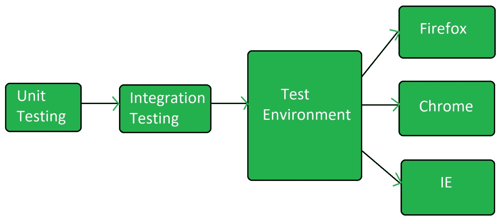

# 软件测试|配置测试

> 原文:[https://www . geesforgeks . org/software-testing-configuration-testing/](https://www.geeksforgeeks.org/software-testing-configuration-testing/)

**配置测试**是[软件测试](https://www.geeksforgeeks.org/software-testing-basics/)的类型，它针对各种软硬件组合来验证正在开发的系统的性能，以找出最佳配置，在该配置下，系统可以在匹配其功能需求的同时无任何缺陷或问题地工作。

配置测试是在支持的软件和硬件的每个配置下测试系统的过程。这里，硬件和软件的不同配置意味着多种操作系统版本、各种浏览器、各种支持的驱动程序、不同的内存大小、不同的硬盘类型、各种类型的中央处理器等。

**各种配置:**

*   **操作系统配置:**

    ```
    Win XP, Win 7 32/64 bit, Win 8 32/64 bit, Win 10 etc. 
    ```

*   **数据库配置:**

    ```
    Oracle, DB2, MySql, MSSQL Server, Sybase etc. 
    ```

*   **浏览器配置:**

    ```
    IE 8, IE 9, FF 16.0, Chrome, Microsoft Edge etc. 
    ```

**配置测试的目标:**
配置测试的目标是:

*   确定软件应用程序是否满足可配置性要求。
*   识别在不同测试过程中没有有效发现的缺陷。
*   确定被测应用程序的最佳配置。
*   通过改变软硬件资源来分析软件应用的性能。
*   基于优先级进行系统效率分析。
*   验证无论配置如何变化，bug 都可以重现的难易程度。

**配置测试流程:**



**配置测试的类型:**
配置测试有两种类型:

1.  **软件配置测试:**
    软件配置测试是在被测应用上用各种操作系统版本和各种浏览器版本等进行的。这是一项耗时的测试，因为安装和卸载用于测试的各种软件需要很长时间。发布构建时，软件配置在通过单元测试和集成测试后开始。
2.  **硬件配置测试:**
    硬件配置测试通常在实验室中进行，在实验室中，物理机器与连接到它们的各种硬件一起使用。
    发布构建时，软件会安装在所有连接了硬件的物理机器上，并在每台机器上进行测试，以确认应用程序运行正常。在进行硬件配置测试时，要测试的硬件种类被详细说明，并且有几个计算机硬件和外围设备使得几乎不可能执行所有测试。

配置测试也可以分为以下两种类型:

1.  **客户端级测试:**
    客户端级测试与可用性和功能性测试相关联。这个测试是从用户的直接利益的角度进行的。
2.  **服务器级测试:**
    进行服务器级测试，确定软件计划发布后集成时，软件与外部环境的通信。