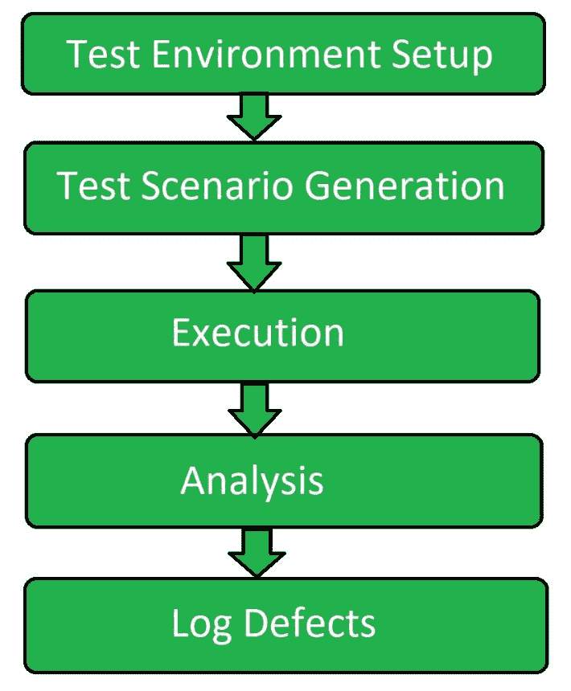

# 软件测试|数据库测试

> 原文:[https://www . geesforgeks . org/software-testing-database-testing/](https://www.geeksforgeeks.org/software-testing-database-testing/)

**数据库测试**是一种检查模式、表、触发器等的软件测试。正在测试的数据库的。它包括创建复杂的查询，以便对数据库执行负载或压力测试，并检查其响应性。它检查数据的完整性和一致性。

数据库测试通常由分层过程组成，包括用户界面(UI)层、业务层、数据访问层和数据库。

**数据库测试的目标:**

1.  **确保数据映射:**
    检查用户界面或前端表单中的字段是否与数据库表中的相应字段映射一致。
2.  **确保事务的 ACID 属性:**
    数据库执行的每个事务都必须坚持这四个属性:*原子性、一致性、隔离性和持久性*。
3.  **确保数据完整性:**
    共享数据的更新值和最新值应出现在所有表单和屏幕上。该值不应在一个屏幕上更新，而在另一个屏幕上显示较旧的值。状态也应该同时更新。
4.  **确保业务规则的准确性:**
    复杂的数据库导致复杂的组件，如关系约束、触发器和存储过程。因此，按照顺序，测试人员会提出适当的 SQL 查询来验证复杂的对象。

**数据库测试属性:**

1.  **事务:**
    事务是指数据的访问和检索。因此，在交易过程中，应遵循 ACID 属性。
2.  **数据库模式:**
    是关于数据库中数据组织的设计或结构。
3.  **触发器:**
    当某个表中发生某个事件时，触发器会被自动指示执行。
4.  **过程:**
    它是数据库中管理事务的语句或函数的集合。

**数据库测试流程:**

1.  **测试环境设置:**
    数据库测试从为要执行的测试过程设置测试环境开始，以便获得良好的质量测试过程。
2.  **测试场景生成:**
    设置好测试环境后，测试用例被设计用来进行测试。测试场景涉及与数据库相关的不同输入和不同事务。
3.  **执行:**
    执行是进行测试的测试过程的核心阶段。它基本上与为测试过程设计的测试用例的执行有关。
4.  **分析:**
    一旦执行阶段结束，则分析所有的过程和获得的输出。检查测试过程是否正确进行。
5.  **日志缺陷:**
    日志缺陷也称为提交报告。在最后一个阶段，测试人员通知开发人员在系统数据库中发现的缺陷。

**与数据库测试相关的误解:**

*   它需要专家进行数据库测试
*   数据库测试的过程是漫长的
*   它增加了额外的工作瓶颈
*   它减缓了整个开发过程
*   这是一个非常昂贵的过程