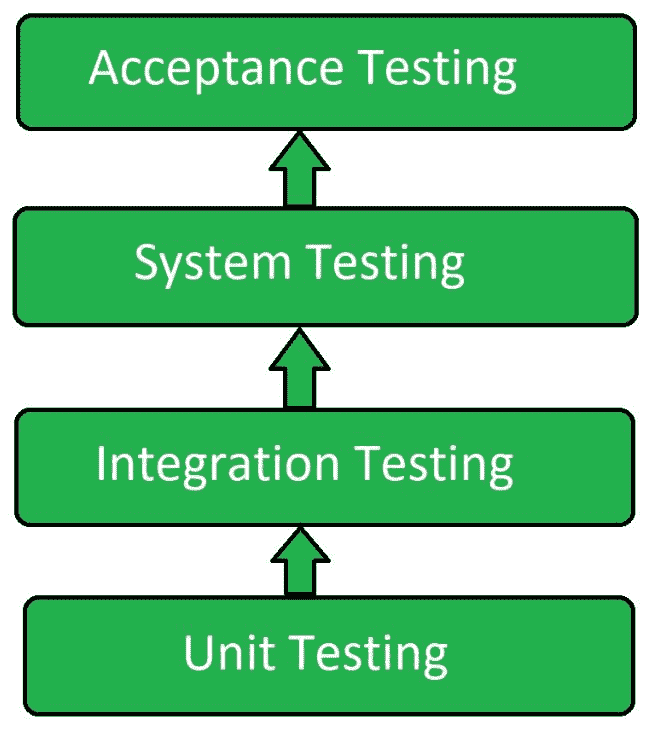
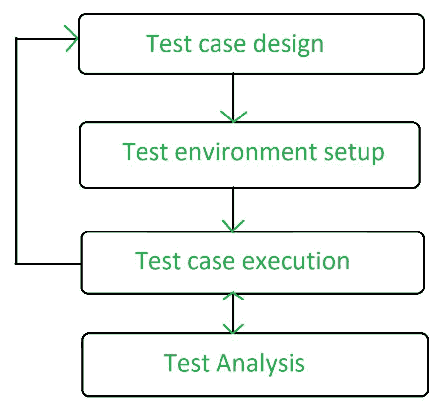

# 软件测试|动态测试

> 原文:[https://www . geesforgeks . org/software-testing-dynamic-testing/](https://www.geeksforgeeks.org/software-testing-dynamic-testing/)

**动态测试**是一种[软件测试](https://www.geeksforgeeks.org/software-testing-basics/)，用于分析代码的动态行为。它包括对软件的输入值和输出值的测试。

动态测试基本上是用来描述代码的动态行为。它指的是观察系统对变量的物理反应，这些变量不是恒定的，而是随时间变化的。为了执行动态测试，应该编译并运行软件。它包括通过给出输入值来使用软件，并通过执行特定的测试用例来检查输出是否如预期的那样，这可以通过手动或自动化过程来完成。

在 2 V，即验证和确认中，确认是动态测试。

**动态测试的等级:**
动态测试有各种等级。它们是:

*   单元测试
*   集成测试
*   系统试验
*   验收测试

**动态测试流程阶段:**

**动态测试的优势:**

*   它揭示了非常困难和复杂的缺陷。
*   动态测试检测静态测试检测不到的缺陷。
*   它提高了被测试的软件产品或应用程序的质量。
*   动态测试检测安全威胁，确保应用程序更安全。

**动态测试的缺点:**

*   这是一个耗时的过程，因为在动态测试中，要执行整个代码。
*   它增加了软件的预算，因为动态测试成本很高。