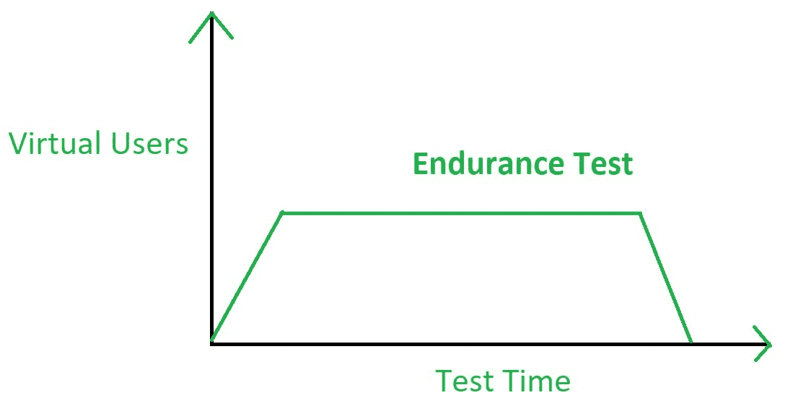

# 软件测试|耐久性测试

> 原文:[https://www . geesforgeks . org/software-testing-duration-testing/](https://www.geeksforgeeks.org/software-testing-endurance-testing/)

**耐久性测试**是[软件测试](https://www.geeksforgeeks.org/software-testing-basics/)的一种类型，执行该测试是为了观察应用程序是否能够承受预期必须长时间承受的处理负载。在耐久性测试期间，内存消耗被认为是决定潜在故障的因素。性能质量也在耐久性测试期间计算。

耐久性测试主要是为了测量被测元件在潜在模拟条件下对特定周期和特定载荷的响应。在耐久性测试期间记录的观察结果被进一步用于改进软件应用的相应参数。耐久测试也称为*浸泡测试*。



耐久性测试包括在系统长时间承受巨大负载的情况下检查系统，并测量系统在这种条件下的反应参数。耐久性测试包括长时间测试操作系统和计算机硬件达到或超过其最大负载。

因此，耐久性测试可以被定义为一种软件测试类型，在这种类型中，系统或软件应用程序以长时间延长的负载进行测试，以观察软件在这种条件下的行为。

它在性能运行周期的最后阶段执行。耐久性测试确保应用程序能够在没有任何响应时间延迟的情况下处理扩展负载。
耐力测试是一个漫长的过程，有时可能会持续长达一年。在耐久性测试中，使用了外部负载，如互联网流量和用户行为。耐久性测试不同于负载测试，因为负载测试会在几个小时后结束。

**耐久试验过程:**

1.  建立测试环境
2.  创建测试计划
3.  测试估计
4.  风险分析
5.  试验进度表
6.  测试执行
7.  测试结束

**耐久测试工具:**

```
1. WebLOAD
2. LoadComplete
3. Apache JMeter
4. LoadRunner
```

**耐久测试的优势:**

*   它决定了系统可以处理的工作量。
*   它有助于识别长时间使用系统时出现的性能问题。