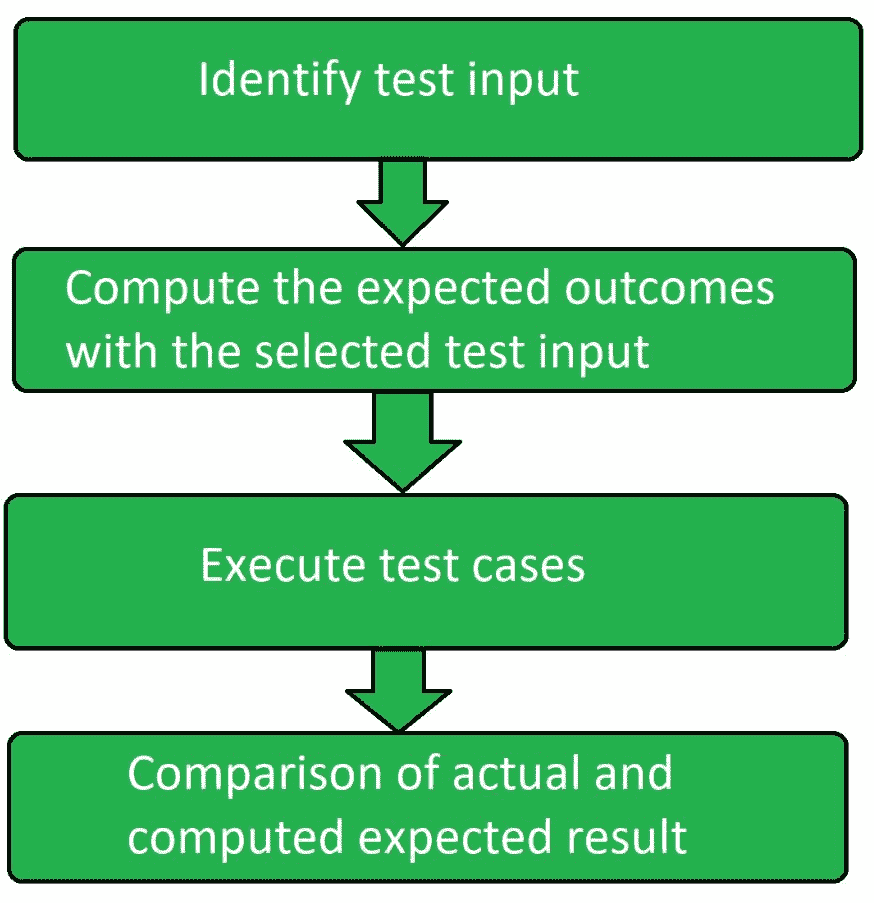

# 软件测试|功能测试

> 原文:[https://www . geesforgeks . org/software-testing-functional-testing/](https://www.geeksforgeeks.org/software-testing-functional-testing/)

功能测试是[软件测试](https://www.geeksforgeeks.org/software-testing-basics/)的一种，在这种测试中，系统根据功能需求和规格进行测试。功能测试确保应用程序正确满足需求或规范。这种类型的测试特别关注处理的结果。它侧重于实际系统使用的模拟，但没有开发任何系统结构假设。

它基本上被定义为一种测试类型，用于验证软件应用程序的每个功能都符合要求和规范。这个测试不关心应用程序的源代码。通过提供适当的测试输入、期望输出以及将实际输出与期望输出进行比较来测试软件应用程序的每个功能。该测试侧重于检查用户界面、应用程序接口、数据库、安全性、客户端或服务器应用程序以及被测应用程序的功能。

功能测试可以是手动的或自动的。

**功能测试流程:**
功能测试涉及以下步骤:

1.  确定要执行的功能。
2.  根据功能规范创建输入数据。
3.  根据功能规格确定输出。
4.  执行测试用例。
5.  比较实际输出和预期输出。



**主要功能测试技术:**

*   单元测试
*   集成测试
*   烟雾测试
*   用户接受度测试
*   接口测试
*   可用性测试
*   系统试验
*   回归测试

**功能测试工具:**

```
1. Selenium
2. QTP
3. JUnit
4. SoapUI
5. Watir 
```

**功能测试的优势:**

*   它确保交付无缺陷的产品。
*   它确保交付高质量的产品。
*   没有关于系统结构的假设。
*   该测试侧重于客户使用的规格。

**功能测试的缺点:**

*   执行冗余测试的可能性很大。
*   产品中可能会遗漏逻辑错误。
*   如果需求不完整，那么执行这个测试就变得很困难。