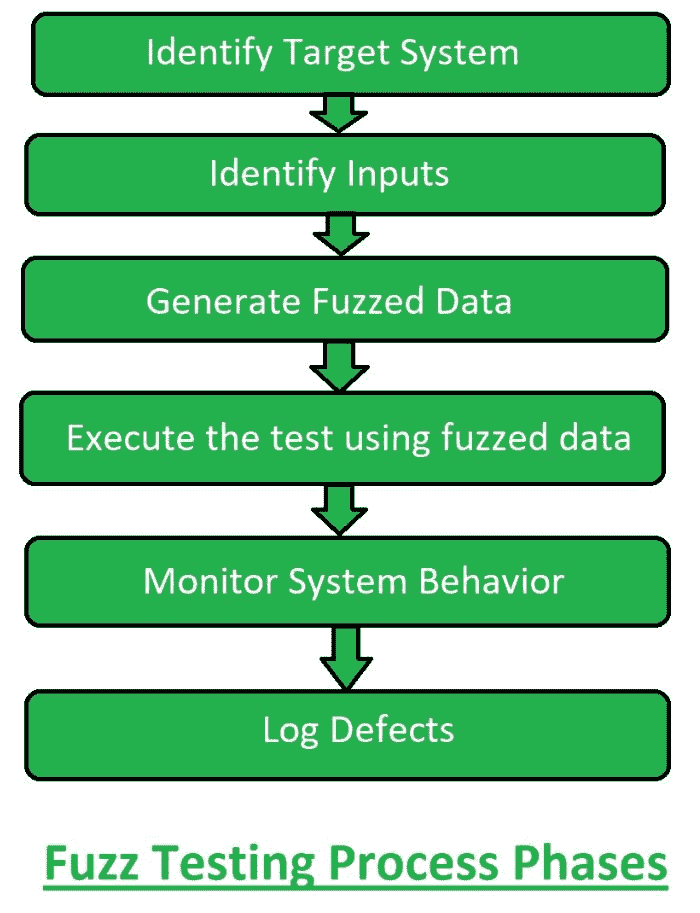

# 软件测试|模糊测试

> 原文:[https://www . geesforgeks . org/software-testing-fuzz-testing/](https://www.geeksforgeeks.org/software-testing-fuzz-testing/)

**模糊测试**是一种[软件测试](https://www.geeksforgeeks.org/software-testing-basics/)技术，它使用无效、意外或随机的数据作为输入，然后检查异常情况，如崩溃和潜在的内存泄漏。这是一种自动化测试技术，用于描述涉及随机或分布式方法的系统测试过程。在模糊测试期间，系统或软件应用程序可能有许多与数据输入相关的不同错误或故障。1989 年，威斯康辛大学的巴顿·米勒首次开发了模糊测试。

**模糊测试的目标:**
模糊测试的目标是:

*   检查系统或软件应用程序的漏洞。
*   检测安全故障和缺陷。
*   确定有效成本的缺陷。

**模糊测试阶段:**



1.  **识别目标系统:**
    标记将要测试的系统或软件应用。那个系统被称为目标系统。目标系统由测试团队确定。
2.  **识别输入:**
    一旦设定了目标系统，随机输入就被创建用于测试。这些随机测试用例被用作测试系统或软件应用的输入。
3.  **生成模糊化数据:**
    在获得随机输入即意外和无效后，这些无效和意外的输入被转换成模糊化数据。模糊化数据基本上是模糊逻辑形式的随机输入。
4.  **使用模糊化数据执行测试:**
    现在使用模糊化数据执行测试过程。基本上在这一部分中，程序或软件的代码是通过给出随机输入即模糊化数据来执行的。
5.  **监控系统行为:**
    在系统或软件应用程序执行后，针对崩溃或任何其他异常(如潜在的内存泄漏)进行操作。在随机输入下测试系统行为。
6.  **记录缺陷:**
    在最后一个阶段，缺陷被识别，这些缺陷被修复，以便得到更好的质量系统或软件应用。

**模糊测试检测到的缺陷类型:**

```
1. Number Fuzzing
2. Character Fuzzing
3. Application Fuzzing
4. Protocol Fuzzing
5. File Format Fuzzing 
```

**模糊测试的优势:**

*   保证了软件的安全性。
*   它检测到的缺陷包括崩溃和潜在的内存泄漏。
*   耗时更少。

**模糊测试的缺点:**

*   它不能提供系统的完全安全性。
*   它对于处理没有病毒、错误或程序崩溃原因的安全威胁无效。
*   它检测简单的故障和威胁。