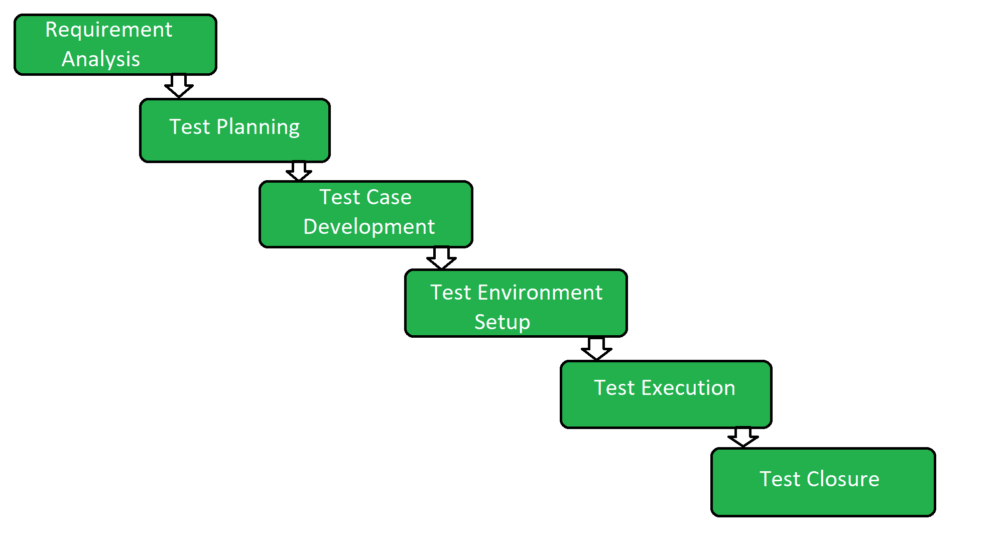

# 软件测试生命周期(STLC)

> 原文:[https://www . geesforgeks . org/software-testing-life cycle-stlc/](https://www.geeksforgeeks.org/software-testing-life-cycle-stlc/)

**软件测试生命周期(STLC)** 是在软件测试过程中执行的一系列不同的活动。

**STLC 的特性:**

*   STLC 是[软件开发生命周期(SDLC)](https://practice.geeksforgeeks.org/problems/software-development-life-cycle) 的一个基本部分，但是 STLC 只包括测试阶段。
*   一旦定义了需求或者涉众共享了软件需求文档，STLC 就开始了。
*   STLC 产生一个循序渐进的过程来确保软件质量。

在 STLC 的初始阶段，当软件产品或应用程序正在开发时，测试团队分析并定义测试范围、进入和退出标准以及测试用例。它有助于减少测试周期时间，也提高了产品质量。
开发阶段一结束，测试团队就准备好测试用例，开始执行。这有助于在早期发现 bug。

**STLC 阶段:**

1.  **需求分析:**
    需求分析是软件测试生命周期(STLC)的第一步。在这一阶段，质量保证团队理解需要测试的需求。如果有任何遗漏或不可理解的地方，那么质量保证团队将与涉众会面，以更好地理解需求的详细知识。
2.  **测试规划:**
    测试规划是软件测试生命周期中最有效的阶段，在这个阶段定义了所有的测试计划。在这个阶段，测试团队的经理计算测试工作的估计工作量和成本。需求收集阶段完成后，此阶段开始。
3.  **测试用例开发:**
    一旦测试计划阶段完成，测试用例开发阶段开始。在这个阶段，测试团队记下详细的测试用例。测试团队还为测试准备所需的测试数据。当测试用例准备好之后，质量保证团队会对它们进行审查。
4.  **测试环境设置:**
    测试环境设置是 STLC 的重要部分。测试环境基本上决定了测试软件的条件。这是独立的活动，可以与测试用例开发一起启动。在这个过程中，测试团队不参与。开发人员或客户创建测试环境。
5.  **测试执行:**
    在测试用例开发和测试环境设置之后，测试执行阶段开始。在这个阶段，测试团队开始根据前面步骤中准备好的测试用例来执行测试用例。
6.  **测试结束:**
    这是 STLC 分析测试过程的最后一个阶段。