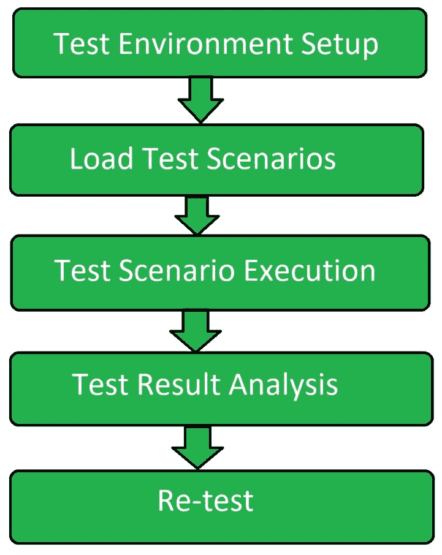

# 软件测试|负载测试

> 原文:[https://www . geesforgeks . org/software-testing-load-testing/](https://www.geeksforgeeks.org/software-testing-load-testing/)

**负载测试**是一种类型的[性能测试](https://www.geeksforgeeks.org/performance-testing-software-testing/)，其确定系统、软件产品或软件应用在基于现实生活的负载条件下的性能。基本上，当多个用户同时使用时，负载测试决定了应用程序的行为。它是在不同负载条件下测量的系统响应。负载测试针对正常和极端负载条件进行。

**负荷测试的目标:**
负荷测试的目标是:

*   最大化软件应用程序的运行能力。
*   确定最新的基础设施是否能够运行软件应用程序。
*   确定应用程序在极端用户负载下的可持续性。
*   找出可以同时访问应用程序的用户总数。
*   确定应用程序的可伸缩性。
*   允许更多用户访问应用程序。

**负荷测试流程:**



1.  **测试环境设置:**
    首先创建一个专用的测试环境设置来执行负载测试。它确保测试以适当的方式进行。
2.  **负载测试场景:**
    第二步，创建负载测试场景。然后为应用程序确定负载测试事务
    ，并为每个事务准备数据。
3.  **测试场景执行:**
    上一步创建的负载测试场景是已知执行的。收集不同的度量和度量来收集信息。
4.  **测试结果分析:**
    分析所执行测试的结果，并提出各种建议。
5.  **重新测试:**
    如果测试失败，则再次进行测试，以便以正确的方式获得结果。

**负载测试工具:**

```
1. Apache Jmeter
2. WebLoad
3. NeoLoad
4. LoadNinja
5. HP Performance Tester
6. LoadUI Pro
7. LoadView 
```

**负载测试的优势:**

*   负载测试增强了系统或软件应用程序的可持续性。
*   它提高了系统或软件应用程序的可扩展性。
*   它有助于最小化与系统停机时间相关的风险。
*   它降低了系统故障的成本。
*   它增加了顾客的满意度。

**负载测试的缺点:**

*   在需要编程知识的地方进行负载测试。
*   负载测试工具可能很昂贵。