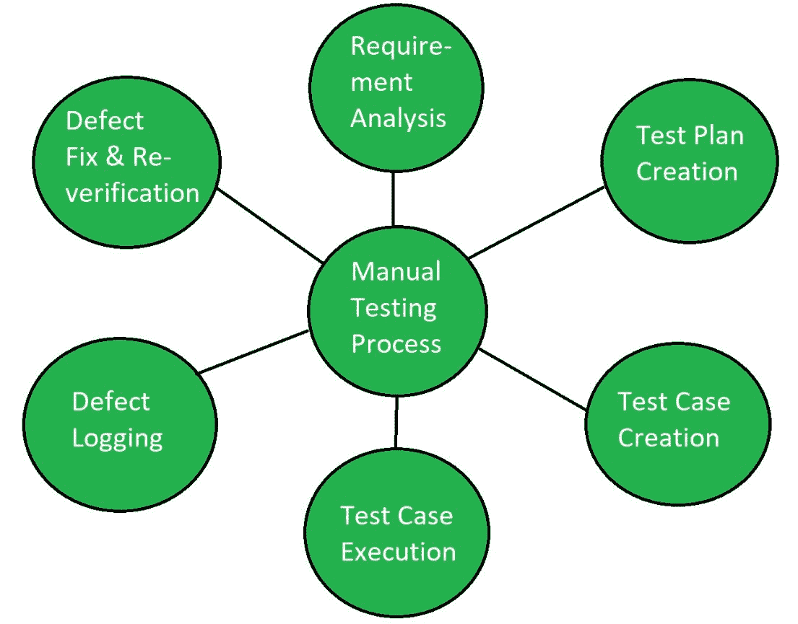

# 软件测试|手动测试

> 原文:[https://www . geesforgeks . org/software-testing-manual-testing/](https://www.geeksforgeeks.org/software-testing-manual-testing/)

**手动测试**是[软件测试技术](https://www.geeksforgeeks.org/software-testing-basics/)，它是使用应用程序的功能和特性来执行的。在手动测试中，测试人员通过遵循一组预定义的测试用例对软件进行测试。在这个测试中，测试人员为代码制作测试用例，测试软件，并给出关于该软件的最终报告。手动测试是一种耗时的测试，因为它是由人完成的，并且有可能出现人为错误。

每个新的应用程序都必须经过手动测试，然后才能自动进行测试。手动测试需要比自动化测试更多的努力，但是对于检查自动化可行性是必要的。手动测试不需要任何测试工具的知识。

**手动测试的特点:**

*   手动测试很耗时。
*   人工测试中出现人为错误的几率很高。
*   探索性测试的可能性。
*   人工测试不需要编程语言。
*   手动测试不使用框架。
*   不太准确。

**手动测试步骤:**

1.  研究软件项目文档和指南。
2.  研究被测应用。
3.  设计涵盖文档中描述的所有需求的测试用例。
4.  与团队领导和客户一起评审和基线化测试用例。
5.  在被测试的应用程序上执行测试用例。
6.  报告错误。
7.  当错误被修复后，再次执行失败的测试用例来验证它们是否通过。

**人工测试的优势:**

*   快速准确的视觉反馈。
*   不太贵。
*   不需要编码。

**手动测试的缺点:**

*   不太可靠。
*   不能重复使用。
*   某些特定任务无法手动执行。