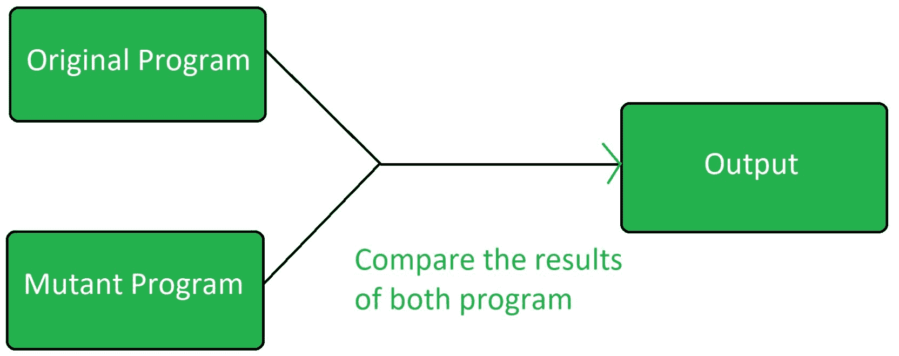

# 软件测试|变异测试

> 原文:[https://www . geesforgeks . org/软件-测试-变异-测试/](https://www.geeksforgeeks.org/software-testing-mutation-testing/)

**变异测试**是一种类型的[软件测试](https://www.geeksforgeeks.org/software-testing-basics/)，其被执行来设计新的软件测试并且也评估已经存在的软件测试的质量。变异测试与小规模修改程序有关。它的重点是帮助测试人员开发有效的测试，或者找出程序使用的测试数据中的弱点。

**突变检测的历史:**
*理查德·利普顿*在 1971 年首次提出了突变检测。虽然高成本减少了变异测试的使用，但现在它被广泛用于 Java 和 XML 等语言。



变异测试是[白盒测试](https://www.geeksforgeeks.org/software-engineering-white-box-testing/)。

变异测试可以应用于设计模型、规范、数据库、测试和 XML。它是一种结构测试技术，使用代码的结构来指导测试过程。它可以被描述为以小的方式重写源代码以消除源代码中的冗余的过程。

**突变检测的目的:**
突变检测的目的是:

*   识别没有被正确测试的代码片段。
*   识别用其他测试方法无法检测到的隐藏缺陷。
*   发现新的错误或错误。
*   来计算变异分数。
*   研究程序中的错误传播和状态感染。
*   评估测试用例的质量。

**突变检测的类型:**
突变检测基本上有 3 种类型:

1.  **Value Mutations:**
    In this type of testing the values are changed to detect errors in the program. Basically a small value is changed to a larger value or a larger value is changed to a smaller value. In this testing basically constants are changed.

    **示例:**

    ```
    Initial Code:

    int mod = 1000000007;
    int a = 12345678;
    int b = 98765432;
    int c = (a + b) % mod;

    Changed Code:

    int mod = 1007;
    int a = 12345678;
    int b = 98765432;
    int c = (a + b) % mod; 
    ```

2.  **Decision Mutations:**
    In decisions mutations are logical or arithmetic operators are changed to detect errors in the program.

    **示例:**

    ```
    Initial Code:

    if(a < b)
     c = 10;
    else
     c = 20;

    Changed Code:

    if(a > b)
     c = 10;
    else
     c = 20; 
    ```

3.  **Statement Mutations:**
    In statement mutations a statement is deleted or it is replaces by some other statement.

    **示例:**

    ```
    Initial Code:

    if(a < b)
     c = 10;
    else
     c = 20;

    Changed Code:

    if(a < b)
     d = 10;
    else
     d = 20; 
    ```

**突变检测的优势:**

*   它在程序中带来了良好的错误检测水平。
*   它发现源代码中的歧义。

**突变检测的缺点:**

*   这是非常昂贵和耗时的。
*   它不能用于黑盒测试。