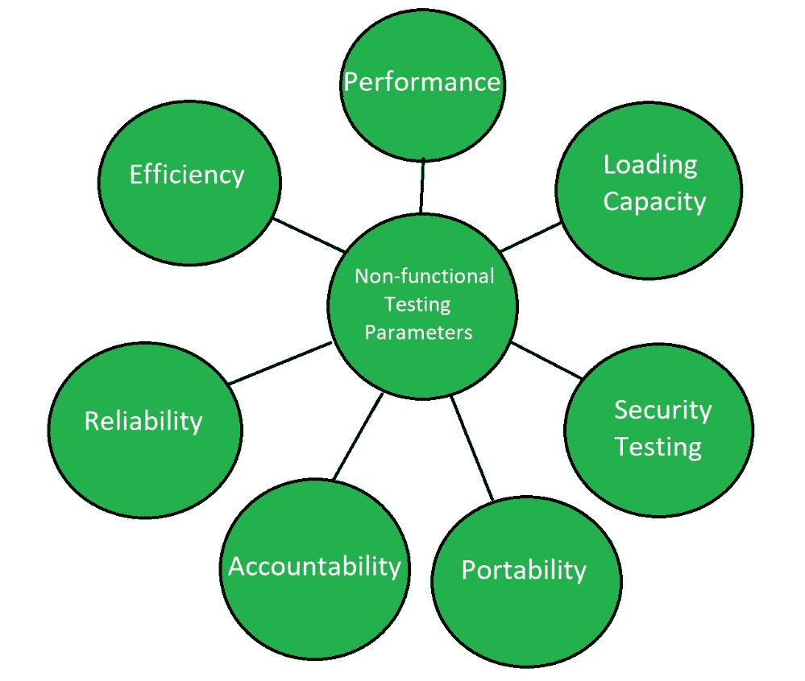

# 软件测试|非功能测试

> 原文:[https://www . geesforgeks . org/software-testing-non-functional-testing/](https://www.geeksforgeeks.org/software-testing-non-functional-testing/)

**非功能测试**是一种[软件测试](https://www.geeksforgeeks.org/software-testing-basics/)，用于验证应用程序的非功能需求。它验证系统的行为是否符合要求。它测试功能测试中未测试的所有方面。

非功能测试是一种检查系统非功能属性的软件测试技术。非功能测试被定义为一种检查软件应用程序非功能方面的软件测试。它旨在根据功能测试从未涉及的非功能参数测试系统的就绪性。非功能测试和功能测试一样重要。

**非功能测试的目标:**
非功能测试的目标是:

*   提高产品的可用性、效率、可维护性和可移植性。
*   帮助降低与产品非功能方面相关的生产风险。
*   帮助降低与产品非功能方面相关的成本。
*   优化产品的安装、执行和监控方式。
*   为内部研究和开发收集和产生测量和度量。
*   提高和加强对产品行为和使用技术的了解。

**非功能测试技术:**

*   兼容性测试
*   符合性测试
*   耐久性测试
*   负载测试
*   性能试验
*   恢复测试
*   安全测试
*   可扩展性测试
*   压力测试

**非功能测试参数:**

