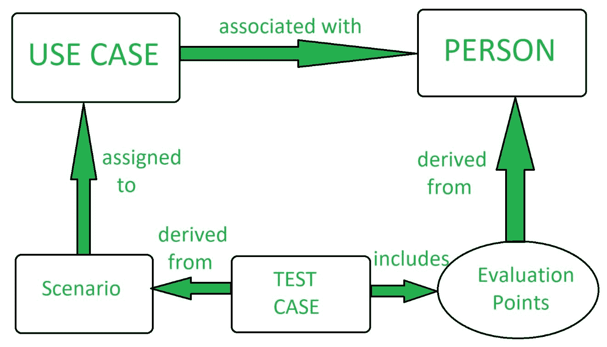

# 软件测试|场景测试

> 原文:[https://www . geesforgeks . org/software-testing-scenario-testing/](https://www.geeksforgeeks.org/software-testing-scenario-testing/)

**场景测试**是一种[软件测试技术](https://www.geeksforgeeks.org/software-testing-basics/)，它使用场景，即推测性的故事来帮助测试人员解决复杂的问题或测试系统。理想的情景测试是一个可靠的、复杂的、令人信服的或激励人心的故事，其结果很容易评估。通常，这些测试不同于测试用例，因为测试用例是单个步骤，而场景包含多个步骤。

执行场景测试是为了确保软件的端到端功能和软件的所有流程都正常工作。在场景测试中，测试人员假设自己是最终用户，并找到最终用户可以在软件上执行的真实场景或用例。在场景测试中，测试人员从客户、涉众和开发人员那里获得帮助来创建测试场景。

场景测试帮助测试人员知道当最终用户使用软件时，软件将如何准确地工作。由于场景测试测试软件的业务流程，所以它有助于找出许多在其他测试的帮助下找不到的缺陷。

场景测试是通过创建复制最终用户使用情况的测试场景来执行的。测试场景是描述最终用户使用软件的故事。

**场景测试的特点:**
一个场景测试有五个关键特点:

*   故事
*   刺激
*   可靠的
*   复杂的
*   易于评估

**场景测试流程:**

**场景测试中的方法:**
场景测试中有两种方法:

1.  **系统场景:**
    该方法中使用的场景测试只是那些覆盖系统中各种组件的真实用户活动集。
2.  **基于用例和角色的场景**
    在基于用例和角色的场景方法中，重点是不同角色和环境的用户如何使用系统。

**场景测试的风险:**

*   场景测试是复杂的，涉及许多特性。
*   场景测试不是为覆盖程序而设计的。
*   场景测试经常被大量记录和反复使用。