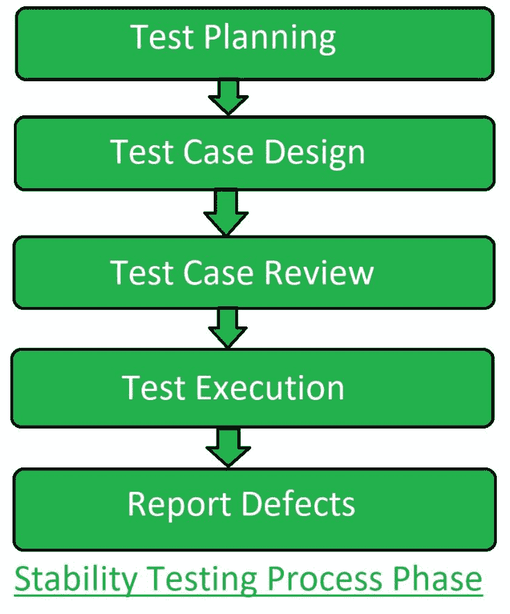

# 软件测试|稳定性测试

> 原文:[https://www . geesforgeks . org/software-testing-stability-testing/](https://www.geeksforgeeks.org/software-testing-stability-testing/)

**稳定性测试**是[软件测试](https://www.geeksforgeeks.org/software-testing-basics/)的一种，用于检查软件在不同环境参数下的质量和行为。它被定义为产品在一段时间内持续运行而不出现故障的能力。

这是一种[非功能测试](https://www.geeksforgeeks.org/software-testing-non-functional-testing/)技术，其重点是最大限度地强调软件组件。稳定性测试是为了检查一个开发产品超出正常运行能力的效率，这就是所谓的断点。它在重负载下对一个产品的错误处理、软件可靠性、健壮性和可扩展性比正常情况下检查系统行为有更高的意义。

稳定性测试评估稳定性问题。这个测试主要是为了检查应用程序是否会在任何时间点崩溃。

**稳定性测试的目的:**
稳定性测试的目的是:

*   对测试中的系统或软件应用程序的稳定性产生信心。
*   确保系统处理大程序。
*   操作系统或软件应用的有效性。
*   检查系统在压力下的稳定性。

**稳定性测试流程:**



**不进行稳定性测试的影响:**

1.  如果不进行稳定性测试，系统会因大量数据而变慢。
2.  没有稳定性测试，系统会突然崩溃。
3.  在没有稳定性测试的情况下，系统在不同环境下的行为是不正常的。
4.  在没有稳定性测试的情况下，系统的性能会下降，这反过来会对业务产生不良影响。

**稳定性测试中使用的测试工具:**

```
1. Apache JMeter
2. NeoLoad
3. WebLOAD
4. LoadRunner 
```

**稳定性测试的优势:**

1.  它给出了系统实际能处理的数据的极限。
2.  它提供了对系统性能的信心。
3.  它决定了系统在负载下的稳定性和鲁棒性。
4.  稳定性测试带来了更好的最终用户体验。