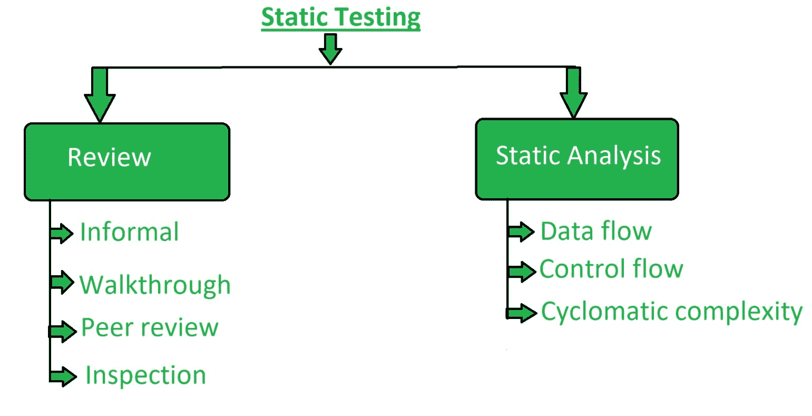

# 软件测试|静态测试

> 原文:[https://www . geesforgeks . org/software-testing-static-testing/](https://www.geeksforgeeks.org/software-testing-static-testing/)

**静态测试**是一种[软件测试](https://www.geeksforgeeks.org/software-testing-basics/)方法，用于检查软件中的缺陷，而无需实际执行软件应用程序的代码。而在动态测试检查中，执行代码是为了检测缺陷。

静态测试在开发的早期阶段执行，以避免错误，因为它更容易找到故障源，并且可以很容易地修复。用动态测试找不到的错误，用静态测试很容易找到。

**静态测试技术:**
静态测试主要采用两种类型的技术:



1.**评审:**
在静态测试中，评审是为了发现软件设计中的潜在缺陷而执行的过程或技术。这是一个检测和消除不同支持文档(如软件需求规范)中的错误和缺陷的过程。人们检查文件，整理错误、冗余和歧义。
评审分为四种类型:

*   **非正式:**
    在非正式评审中，文件的创建者将内容放在观众面前，每个人都给出自己的意见，因此在早期阶段就发现了缺陷。
*   **演练:**
    基本上是由有经验的人或专家来检查缺陷，这样在开发或测试阶段就不会再有问题了。
*   **同行评审:**
    同行评审是指互相检查文件，以发现并修复缺陷。这基本上是在一个同事团队中完成的。
*   **检查:**
    检查基本上是对上级文件的验证，就像软件需求规格(SRS)的验证一样。

2.**静态分析:**
静态分析包括对开发人员编写的代码质量的评估。使用不同的工具对代码进行分析，并将其与标准进行比较。
它还有助于以下缺陷的识别:

```
(a) Unused variables
(b) Dead code
(c) Infinite loops
(d) Variable with undefined value
(e) Wrong syntax 
```

静态分析有三种类型:

*   **数据流:**
    数据流与流处理相关。
*   **控制流:**
    控制流基本上就是语句或指令如何执行。
*   **圈复杂度:**
    圈复杂度是对程序复杂度的度量，它基本上与程序控制流图中独立路径的数量有关。