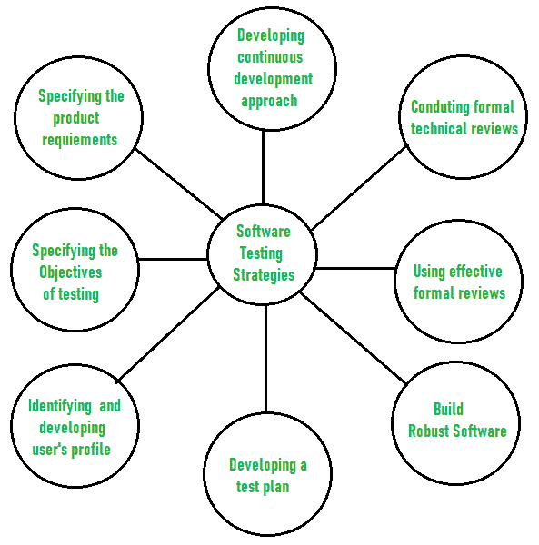

# 软件测试策略

> 原文:[https://www.geeksforgeeks.org/software-testing-strategies/](https://www.geeksforgeeks.org/software-testing-strategies/)

[软件测试](https://www.geeksforgeeks.org/software-testing-basics/)是一种调查类型，旨在找出软件中是否存在任何默认或错误，以便减少或消除错误，从而提高软件质量，并检查软件是否满足指定的要求。

根据格伦·迈尔斯的说法，软件测试有以下目标:

*   调查和检查程序以发现是否有错误以及它是否满足要求的过程称为测试。
*   当测试期间发现的错误数量很高时，这表明测试是好的，并且是好的测试用例的标志。
*   发现一个尚未被发现的未知错误是一个成功的好的测试案例的标志。

软件测试的主要目标是设计测试，使其系统地发现不同类型的错误，而不需要花费太多的时间和精力，从而减少软件开发所需的时间。

测试软件的总体策略包括:

1.  **Before testing starts, it’s necessary to identify and specify the requirements of the product in a quantifiable manner.**
    Different characteristics quality of the software is there such as maintainability that means the ability to update and modify, the probability that means to find and estimate any risk, and usability that means how it can easily be used by the customers or end-users. All these characteristic qualities should be specified in a particular order to obtain clear test results without any error.
2.  **Specifying the objectives of testing in a clear and detailed manner.**
    Several objectives of testing are there such as effectiveness that means how effectively the software can achieve the target, any failure that means inability to fulfill the requirements and perform functions, and the cost of defects or errors that mean the cost required to fix the error. All these objectives should be clearly mentioned in the test plan.
3.  **For the software, identifying the user’s category and developing a profile for each user.**
    Use cases describe the interactions and communication among different classes of users and the system to achieve the target. So as to identify the actual requirement of the users and then testing the actual use of the product.
4.  **制定测试计划，赋予价值并专注于快速循环测试。**
    快速循环测试是一种通过识别和测量软件过程改进所需的任何变化来提高质量的测试。因此，测试计划是帮助测试人员执行快速循环测试的重要而有效的文档。

*   **Robust software is developed that is designed to test itself.**
    The software should be capable of detecting or identifying different classes of errors. Moreover, software design should allow automated and regression testing which tests the software to find out if there is any adverse or side effect on the features of software due to any change in code or program.*   **Before testing, using effective formal reviews as a filter.**
    Formal technical reviews is technique to identify the errors that are not discovered yet. The effective technical reviews conducted before testing reduces a significant amount of testing efforts and time duration required for testing software so that the overall development time of software is reduced.*   **Conduct formal technical reviews to evaluate the nature, quality or ability of the test strategy and test cases.**
    The formal technical review helps in detecting any unfilled gap in the testing approach. Hence, it is necessary to evaluate the ability and quality of the test strategy and test cases by technical reviewers to improve the quality of software.*   **For the testing process, developing a approach for the continuous development.**
    As a part of a statistical process control approach, a test strategy that is already measured should be used for software testing to measure and control the quality during the development of software.