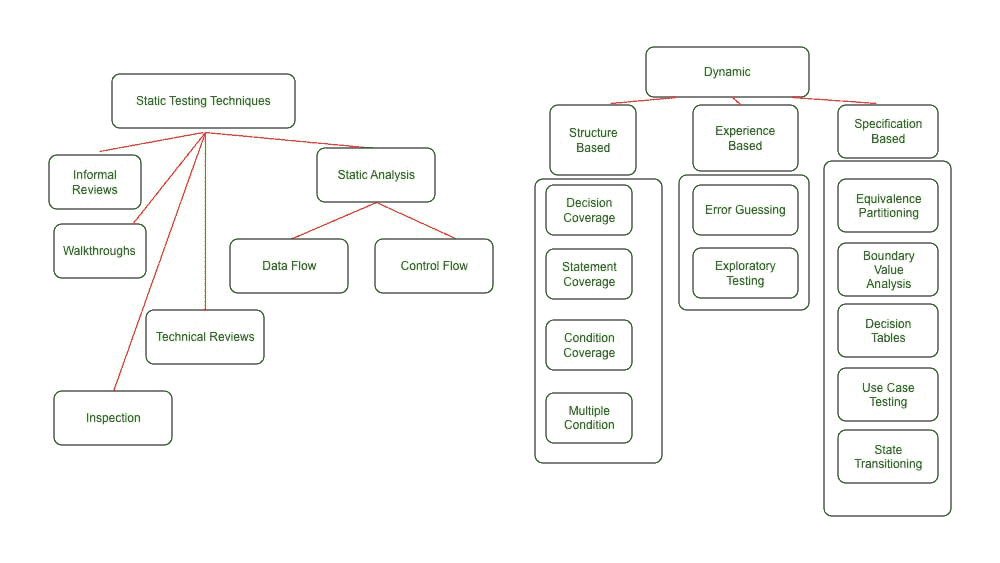
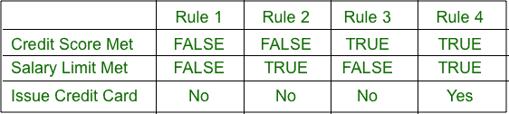
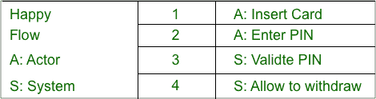
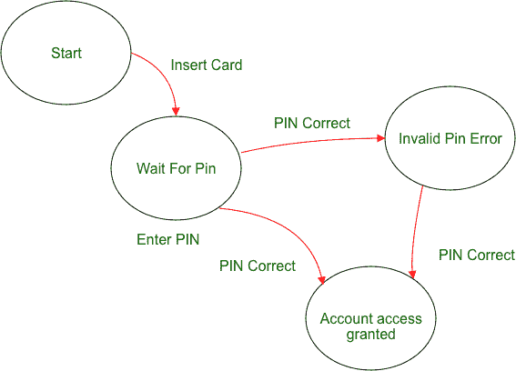

# 软件测试技术

> 原文:[https://www.geeksforgeeks.org/software-testing-techniques/](https://www.geeksforgeeks.org/software-testing-techniques/)

[软件测试技术](https://www.geeksforgeeks.org/types-software-testing/)是根据从业务中收集的[功能性或非功能性需求](https://www.geeksforgeeks.org/functional-vs-non-functional-requirements/)来测试被测应用的方法。每种测试技术都有助于找到特定类型的[缺陷](https://www.geeksforgeeks.org/defect-management-process/)。例如，可能发现[结构缺陷](https://www.geeksforgeeks.org/types-of-defects-in-software-development/)的技术可能无法发现端到端业务流的缺陷。因此，在测试项目中应用多种测试技术，以可接受的质量结束项目。

### 测试原理

以下是软件测试的原则:

1.  所有的测试都应该满足客户的要求。
2.  为了使我们的软件测试应该由第三方来执行
3.  详尽的测试是不可能的。因为我们需要基于应用程序风险评估的最佳测试量。
4.  所有要进行的测试都应该在实施之前进行规划
5.  它遵循帕累托法则(80/20 法则)，即 80%的错误来自 20%的程序组件。
6.  从小零件开始测试，并扩展到大零件。

### 软件测试技术的类型

有两大类软件测试技术:

1.  [**【静态测试技术】**](https://www.geeksforgeeks.org/types-of-static-testing/) 是用于在不执行代码的情况下发现被测应用程序中的缺陷的测试技术。进行静态测试是为了避免开发周期早期阶段的错误，从而降低修复错误的成本。
2.  [**动态测试技术**](https://www.geeksforgeeks.org/software-testing-dynamic-testing/) 是用于测试被测应用程序动态行为的测试技术，即通过代码库的执行。动态测试的主要目的是用动态输入测试应用程序——根据要求，有些输入是允许的(正测试)，有些是不允许的(负测试)。

每种测试技术都有更多的类型，如下图所示。下面将通过例子详细解释其中的每一个。

测试技术

### 静态测试技术

如前所述，静态测试技术是不需要执行代码库的测试技术。静态测试技术分为两大类:

1.  [**评审**](https://www.geeksforgeeks.org/software-engineering-software-review/) **:** 它们的范围可以从工件(代码/测试用例/测试数据)上两个开发人员/测试人员之间纯粹非正式的同行评审，到完全正式的**检查**，这些检查由组织内部/外部的版主领导。
    1.  [**同行评审**](https://www.geeksforgeeks.org/difference-between-pair-programming-and-peer-reviews/) **:** 非正式评审一般在没有任何正式设置的情况下进行。是同龄人之间。例如——两个开发人员/测试人员互相评审对方的工件，比如代码/测试用例。
    2.  [**【演练】**](https://www.geeksforgeeks.org/difference-between-inspection-and-walkthrough/) :演练是一个类别，其中工作(代码或测试用例或正在审查的文档)的作者向涉众展示他/她所做的事情及其背后的逻辑，以达成共识或获得反馈的意图。
    3.  [**技术评审**](https://www.geeksforgeeks.org/difference-between-software-inspection-and-technical-review/) **:** 这是一个评审会议，只关注被评审文件的技术方面，以达成共识。它很少或根本不关注基于参考文件的缺陷识别。像建筑师/首席设计师这样的技术专家需要进行评审。它可以从非正式到正式。
    4.  [**检查**](https://www.geeksforgeeks.org/difference-between-inspection-and-walkthrough/) **:** 检查是最正式的一类审查。在检查之前，被检查的文件在进行检查之前被彻底准备好。在检查会议中确定的缺陷被记录在缺陷管理工具中，并一直跟踪到结束。避免了对缺陷的讨论，并且使用单独的讨论阶段进行讨论，这使得检查成为非常有效的审查形式。
2.  [**【静态分析】**](https://www.geeksforgeeks.org/types-of-static-analysis-methods/) **:** 静态分析是对需求/代码或设计的检查，目的是识别可能导致或可能不会导致故障的缺陷。例如-查看以下标准的代码。不遵循标准是一种缺陷，可能会也可能不会导致失败。有许多静态分析工具主要由开发人员在组件或集成测试之前或期间使用。甚至**编译器**也是一个静态分析工具，因为它指出了不正确的语法用法，并且它本身不执行代码。代码结构有几个方面，即数据流、控制流和数据结构。
    1.  [**【数据流】**](https://www.geeksforgeeks.org/levels-in-data-flow-diagrams-dfd/) **:** 是指在给定的程序中如何跟踪数据踪迹——如何按照程序中的指令访问和修改数据。通过数据流分析，您可以识别缺陷，比如从未使用过的变量定义。
    2.  [**控制流**](https://www.geeksforgeeks.org/software-engineering-control-flow-graph-cfg/) **:** 它是程序指令如何执行的结构，即条件、迭代或循环。控制流分析有助于识别缺陷，如死代码，即在任何情况下都不会被使用的代码。
    3.  [**数据结构**](https://www.geeksforgeeks.org/data-structures/) **:** 是指数据的组织，与代码无关。数据结构的复杂性增加了代码的复杂性。因此，它提供了如何在给定代码中测试控制流和数据流的信息。

### 动态测试技术

动态技术分为三类:

#### 1.基于结构的测试:

这些也被称为[白盒技术](https://www.geeksforgeeks.org/software-engineering-white-box-testing/)。[基于结构的测试技术](https://www.geeksforgeeks.org/structural-software-testing/)关注代码结构如何工作，并相应地进行测试。为了理解基于结构的技术，我们首先需要理解代码覆盖的概念。

[代码覆盖](https://www.geeksforgeeks.org/code-coverage-testing-in-software-testing/)通常在[组件和集成测试](https://www.geeksforgeeks.org/difference-between-component-and-unit-testing/)中完成。它确定了在编写的全部代码中，哪些代码被结构测试技术覆盖。代码覆盖率的一个缺点是——它根本不讨论没有被编写的代码(错过的需求)，市场上有工具可以帮助衡量代码覆盖率。

测试代码覆盖率有多种方法:

**1。语句覆盖范围:**已执行代码的语句数/语句总数。例如，如果一个代码段有 10 行，而您设计的测试只覆盖了其中的 5 行，那么我们可以说测试给出的语句覆盖率是 50%。

**2。决策覆盖范围:**执行的决策结果数/决策总数。例如，如果一个代码段有 4 个决策(如果条件)，而您的测试只执行 1 个，那么决策覆盖率为 25%

**3。条件/多条件覆盖:**它的目的是确定程序中每个逻辑条件的每个结果都已被执行。

#### 2.基于经验的技术:

这些是在多年经验的帮助下执行测试活动的技术。领域技能和背景是这类测试的主要贡献者。这些技术主要用于[UAT/商业用户测试](https://www.geeksforgeeks.org/difference-between-system-testing-and-acceptance-testing/)。这些工作基于结构化技术，如基于规范和基于结构，并且是对它们的补充。以下是基于经验的技术类型:

**1。** [**错误猜测**](https://www.geeksforgeeks.org/bebugging-in-software-testing/) **:** 它由测试经验丰富的测试人员使用，因此他们可能知道系统的弱点。当单独使用时，它不是一种有效的技术，但是当与结构化技术一起使用时，它确实很有帮助。

**2。******:**这是实践测试，目的是以最少的计划获得最大的执行覆盖率。测试设计和执行是并行进行的，没有记录测试设计步骤。这种类型的测试的关键方面是测试人员了解被测应用程序的优点和缺点。类似于错误猜测，它与其他形式技术一起使用是有用的。**

#### **3.基于规范的技术:**

**这包括功能性和非功能性技术(即质量特征)。它基本上意味着基于业务的功能或非功能规范来创建和执行测试。它的重点是识别与给定规格相对应的缺陷。以下是基于规范的技术类型:**

****1。** [**【等价划分】**](https://www.geeksforgeeks.org/equivalence-partitioning-method/) **:** 一般一起使用，可以应用于任何级别的测试。其思想是将数据的输入范围划分为有效和无效部分，这样一个分区就被认为是“等效的”。一旦我们确定了分区，它只需要我们用给定分区中的任何值进行测试，假设分区中的所有值都将表现相同。例如，如果输入字段取 1-999 之间的值，那么 1-999 之间的值将产生类似的结果，我们不需要用每个值进行测试来调用测试完成。**

****2。** [**边界值分析(BVA)**](https://www.geeksforgeeks.org/boundary-value-analysis-triangle-problem/) **:** 该分析测试范围的边界-有效和无效。在上面的示例中，0、1、999 和 1000 是可以测试的边界。这种测试背后的原因是，通常情况下，代码中不会优雅地处理边界。**

****3。** [**【决策表】**](https://www.geeksforgeeks.org/software-engineering-decision-table/) **:** 这些都是测试输入组合的好方法。也叫[因果](https://www.geeksforgeeks.org/cause-effect-graphing-in-software-engineering/)表。用外行人的语言来说，我们可以将适用于测试中的应用程序段的条件构建成一个表格，并根据每个条件来确定结果，从而实现有效的测试。**

1.  **要考虑到组合不要太多，这样桌子就变得太大了，没效果。**
2.  **以信用卡为例，如果信用评分和工资限额都满足，就会发行信用卡。这可以在下面的决策表中说明:**

**

决策表** 

****4。** [**使用基于用例的测试**](https://www.geeksforgeeks.org/software-testing-use-case-testing/) **:** 这种技术帮助我们识别作为一个整体执行系统的测试用例——就像一个实际的[用户(Actor)](https://www.geeksforgeeks.org/unified-modeling-language-uml-sequence-diagrams/) ，一个接一个的事务。用例是描述参与者和系统之间交互的一系列步骤。它们总是用参与者的语言来定义，而不是系统。这个测试在识别集成缺陷方面是最有效的。用例还定义了流程的任何先决条件和后置条件。自动柜员机示例可以通过用例进行测试:**

**

基于用例的测试** 

****5。** [**【状态转换测试】**](https://www.geeksforgeeks.org/state-transition-testing/) **:** 用于被测应用程序或其一部分可被视为有限状态机或有限状态机的情况。继续上面简化的自动柜员机示例，我们可以说自动柜员机流具有有限的状态，因此可以用状态转换技术进行测试。需要考虑 4 个基本因素–**

1.  **系统可以实现的状态**
2.  **导致状态改变的事件**
3.  **从一种状态到另一种状态的转变**
4.  **状态变化的结果**

**可以创建状态事件对表来导出测试条件，包括正测试条件和负测试条件。**

**

状态迁移**