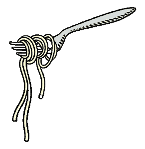

# 意大利面代码

> 原文:[https://www.geeksforgeeks.org/spaghetti-code/](https://www.geeksforgeeks.org/spaghetti-code/)

在这篇文章中，我们将讨论意大利面代码，我们经常听到这个术语，意大利面代码，我们应该避免它。但是到底什么是意大利面代码呢？我们为什么要避免它？

**概述:**
意大利面条代码只不过是对非结构化和难以阅读的代码的一个通用术语。在任何大型代码库中，这种类型的代码如果不能及时解决，就会产生自己的问题。因为代码没有结构，所以它会导致大量浪费重要的资源，比如时间和精力来发现错误并修复它们。



**示例:**
下面给出的是意大利面代码示例如下。

**BASIC 语言的非结构化代码–**

```
1 i=0
2 i=i+1
3 PRINT i; "squared=";i*i
4 IF i>=100 THEN GOTO 6
5 GOTO 2
6 PRINT "Program Completed."
7 END
```

**上述示例的结构化代码–**

```
1 FOR i=1 TO 100
2     PRINT i;"squared=";i*i
3 NEXT i
4 PRINT "Program Completed."
5 END
```

**意大利面条代码如何在你的代码库中结束:**
在一个非常大的代码库中发生这种情况有几个原因。它主要发生在如下场景中。

1.  随着时间的推移，最佳开发实践已经过时，现有的系统也无法用最新的实践进行优化。
2.  开发人员被改变或转移到一个新的团队，他们倾向于编写适合他们的风格和习惯的代码，无意中扰乱了整个代码库。
3.  经验不足的程序员用非结构化代码、过多的 GOTO 语句或很少的注释来改变代码库。

**预防步骤:**
通过上面的讨论，已经非常清楚，从长远来看，意大利面代码是失败的完美处方。因此，每个组织和程序员都必须采取预防措施，以避免在他们的代码库中积累意大利面条代码。有许多基本规则和方法可以记住，以保持效率，避免意大利面代码。它们如下:

*   **写评论**–
    写评论被认为是程序员中非常好的做法。注释不仅有助于程序员编写实际的代码，也有助于阅读代码的人。它清楚地说明了代码的特定部分是做什么的，并节省了宝贵的时间。

*   **了解代码库**–
    在一家公司开始一个新职位时，通常建议你在从事任何重要的编程相关工作之前，先学习他们的方法和风格。这将帮助你理解那里的事情是如何工作的，并且将帮助你更好地理解他们的代码库**的结构。**

*   **执行单元测试**–
    如果您执行常规单元测试，您可以减少意大利面代码发生的概率。

*   **使用轻量级框架**–
    在所有现代编程语言中都有大量的框架和库，可以帮助你用几行代码执行数百个函数。这就是，你的代码变得更精简，更容易发现和修复错误。

*   **总是反复检查**–
    再检查一遍代码的某个部分永远不会对你造成伤害，比在成千上万行意大利面中找到你的 bug 要多得多。