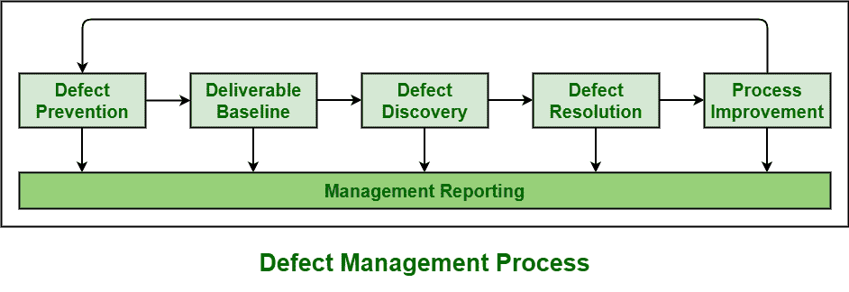

# 缺陷管理过程的阶段

> 原文:[https://www . geesforgeks . org/stages-of-of-definition-management-process/](https://www.geeksforgeeks.org/stages-of-defect-management-process/)

**缺陷管理过程(DMP)** 基本定义为识别和解决缺陷的过程。软件开发不是一个容易的过程。这是一个非常复杂的过程，所以不断出现缺陷是正常的。DMP 通常发生在测试产品的阶段。从软件中删除所有缺陷也是不可能的。我们只能最小化缺陷的数量及其对软件开发的影响。DMP 主要致力于预防缺陷，尽早发现缺陷，减少缺陷的影响。

**DMP 的阶段:**
发生在 DMP 的不同阶段如下:

1.  **缺陷预防:**
    早期消除缺陷是减少其影响的最好方法之一。在早期阶段，修复或解决缺陷需要较少的成本，并且影响也可以最小化。但是在后期，发现缺陷然后修复需要非常高的成本，缺陷的影响也会增加。不可能消除所有缺陷，但至少我们可以尝试降低其影响和修复缺陷所需的成本。这个过程通过在早期消除缺陷来简单地提高软件质量，并且通过简单地防止缺陷注入软件产品来提高生产率。

*   **交付品基线:**
    当此类产品或文档的交付品达到其预定义的里程碑时，则交付品被视为基线。预定义的里程碑通常定义项目或软件应该达到的目标。如果有任何未能达到或达到预先定义的里程碑，这只是意味着项目没有朝着计划前进，通常会触发管理层采取纠正措施。当一个可交付成果是基线时，进一步的变化是可控的。*   **缺陷发现:**
    早期的缺陷发现非常重要。后记，可能会造成更大的伤害。只有当开发人员确认缺陷是有效的，缺陷才被认为是“发现的”。*   **缺陷解决方案:**
    缺陷由开发人员解决和修复，然后将其放置在最初识别缺陷的相同位置。*   **Process Improvement :**

    所有被识别的缺陷都是关键的，并对系统造成一些影响。这并不意味着对系统影响小的缺陷不重要。对于过程改进，每一个被识别的缺陷都需要修复。应该对出现缺陷的过程进行识别和分析，这样我们就可以确定不同的方法来改进过程，以防止将来出现类似的缺陷。