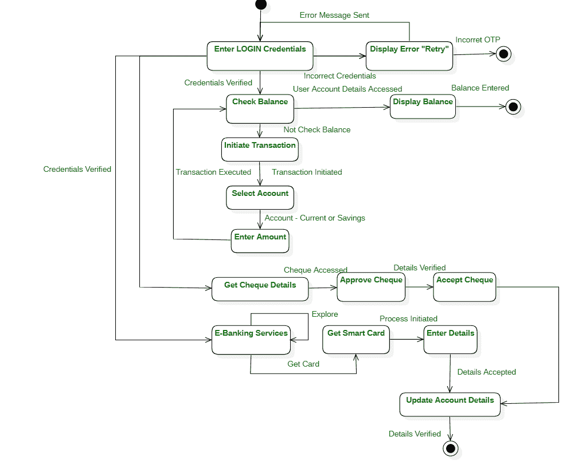

# 网银系统状态图

> 原文:[https://www . geesforgeks . org/state-diagram-for-online-banking-system/](https://www.geeksforgeeks.org/state-diagram-for-online-banking-system/)

[状态图](https://www.geeksforgeeks.org/unified-modeling-language-uml-state-diagrams/)用于建模和呈现系统的动态特性。状态图由不同的状态组成，这些状态表示对应于事件的活动或动作。事件导致状态图中从一种状态转换到另一种状态。因此，状态图是关于内部或外部事件的控制流的图形表示。
网上银行系统状态图如下–

状态图-网上银行系统

网上银行系统状态图描述如下

*   用户可以通过使用有效的登录凭证登录系统来访问服务，该凭证对于银行的每个注册客户都是唯一的。因为图中的第一个状态表示输入登录凭据以验证和确认用户的操作。但是，如果登录凭据不正确，则会转换到下一个状态以显示错误消息。此外，用户现在可以重试登录系统。经过几次尝试后，如果用户未能输入正确的一次性密码，用户将无法再次尝试，并且该过程会遇到最终状态。
*   如果用户凭证被验证，则允许用户检查余额或获取正在处理的支票的详细信息，或者利用银行提供的其他服务。如果操作是检查余额，系统将从数据库中检索用户的数据，用户帐户中的余额将显示在下一个状态中。检查平衡的过程终止，过程进入最后阶段。
*   但是，如果用户选择启动事务，则用户选择启动一个在图中表示为特定状态的事务。此外，在交易成功启动后，用户必须在下一状态中选择账户类型。用户选择账户，该账户作为内部事件触发下一个状态，允许用户输入要交易的金额。交易执行后，控制流程再次转移到检查余额，用户可以在交易后检查账户余额。如上所述，该过程在最后阶段再次终止。
*   用户还可以在银行登记支票、批准支票并获得对用户有利的支票详细信息，这在图中也表示为具有定向关联的动作。
*   用户可以利用其他电子银行服务，在那里用户可以获得智能卡。该过程的启动导致下一个状态，在该状态下，用户可以提交细节来启动注册以获得智能卡。
*   最终，用户可以更新帐户详细信息并退出系统，这是如图所示的最终状态。

因此，状态图能够显示系统中所有类对外部或内部刺激的响应或行为。