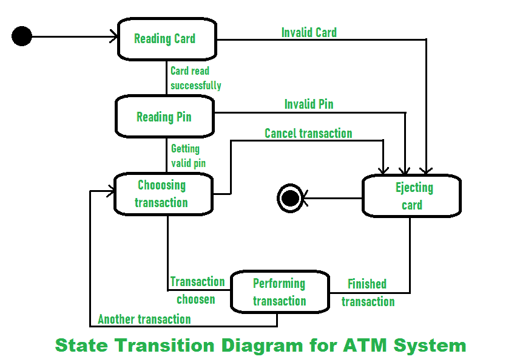

# 自动柜员机系统的状态转换图

> 原文:[https://www . geesforgeks . org/state-transition-graph-for-an-ATM-system/](https://www.geeksforgeeks.org/state-transition-diagram-for-an-atm-system/)

**UCC 状态转换图**也称为动态模型。顾名思义，它是一种图表类型，用于表示系统的不同转换(变化)状态。它通常用于以图形方式表示系统可能具有的所有可能的转换状态，并对这些系统进行建模。从一开始，面向对象建模就非常必要、重要和正确。

系统由各种状态组成，这些状态在状态转换图中用各种符号表示。您可以看到下面给出的符号及其描述:

1.  **Initial State –**

    

2.  **Final State –**

    

3.  **Simple State –**

    

4.  **Composite State –**

    

| 国家类型 | 描述 |
| 初态 | 在系统中，它代表开始状态。 |
| 末态 | 在系统中，它代表结束状态。 |
| 简单状态 | 在系统中，它代表没有子结构的简单状态。 |
| 复合状态 | 在系统中，它代表一个复合状态，有两个或多个并行或并发的状态，在这些状态中，一次只有一个状态是活动的，而其他状态是非活动的。 |

现在我们来看看 **[自动柜员机(ATM)](https://www.geeksforgeeks.org/use-case-diagram-for-bank-atm-system/)** 系统的状态转移图。在这里，您将看到客户使用自动柜员机卡进行交易时的处理。

当客户将银行或信用卡插入自动柜员机的读卡器时，输入操作(即读卡)由自动柜员机执行。如果卡无效，机器将执行退出操作。读卡成功后，自动柜员机会要求输入密码。然后客户输入密码，自动取款机读取密码。如果输入的 pin 无效，机器将执行退出操作。如果输入的 pin 有效，则机器进一步处理交易。交易成功后，机器进行退出操作，即弹出卡，将客户的卡取出。