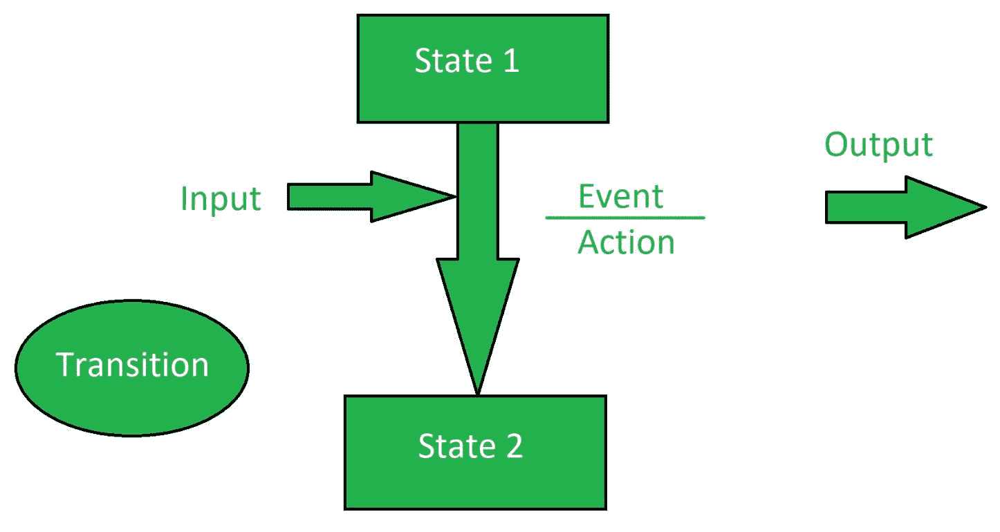

# 状态转换测试

> 原文:[https://www.geeksforgeeks.org/state-transition-testing/](https://www.geeksforgeeks.org/state-transition-testing/)

**状态转换测试**是一种软件测试，用于检查应用程序在不同输入下的状态变化。改变输入通过的条件，观察状态的变化。

状态转换测试基本上是一种黑盒测试技术，它是为了观察系统或应用程序对于按顺序传递的不同输入条件的行为而执行的。在这种类型的测试中，会提供正输入值和负输入值，并观察系统的行为。

状态转换测试基本上用于需要测试不同系统转换的地方。

**状态转换测试的目标:**
状态转换测试的目标是:

*   测试系统在不同输入下的行为。
*   测试对过去值的依赖性。
*   测试应用程序转换状态的变化。
*   测试系统的性能。

**过渡状态:**

*   **改变模式:**
    当该模式被激活时，显示模式从时间变为日期。
*   **复位:**
    当显示模式为时间或日期时，复位模式分别设置为更改时间或更改日期。
*   **时间设置:**
    当该模式被激活时，显示模式从更改时间变为时间。
*   **日期设置:**
    当该模式被激活时，显示模式从 ALTER DATE 变为 Date。

**状态转移图:**
状态转移图显示系统状态如何在某些输入上发生变化。
它有四个主要组成部分:

1.  州
2.  过渡
3.  事件
4.  行动

**状态转移测试的优势:**

*   状态转换测试有助于理解系统的行为。
*   状态转换测试给出了系统行为的适当表示。
*   状态转换测试涵盖了所有条件。

**状态转换测试的缺点:**

*   状态转换测试不能在所有地方执行。
*   状态转换测试并不总是可靠的。