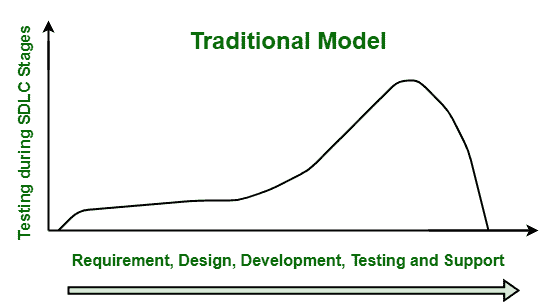

# 左移测试步骤

> 原文:[https://www.geeksforgeeks.org/steps-for-shift-left-testing/](https://www.geeksforgeeks.org/steps-for-shift-left-testing/)

[**Shift Left Testing**](https://www.geeksforgeeks.org/shift-left-testing-approach/) ，顾名思义，基本上是开发过程中较早来到测试的一种方法论或方法。它主要关注于在程序的几乎所有基本和关键阶段包含或涉及测试人员。它的主要目标是通过在生命周期中尽可能早地将任务向左转移来提高质量。左移不是处理每一个 bug 或缺陷以及开发后的关键问题，而是专注于预防缺陷和降低风险。

通过防止缺陷，也鼓励使用 [BDD(行为驱动开发)](https://www.geeksforgeeks.org/difference-between-bdd-vs-tdd-in-software-engineering/)和 [TDD(测试驱动开发)](https://www.geeksforgeeks.org/test-driven-development-tdd/)。它还支持并鼓励测试团队在软件开发过程的早期与所有利益相关者合作。在软件开发生命周期的早期，测试发生在生命周期的末期。因此，修复开发过程后期发现的缺陷变得更加困难和昂贵。但是使用左移测试，缺陷会在开发过程中更早地被发现，这使得修复它们变得更容易，成本也更低。因此，重要的是从左移方法开始，以避免昂贵的错误。

 

#### **开始左移的步骤:**

**1。计划测试生命周期-**
计划是非常重要的管理技术。无论是个人还是职业，这都是非常重要的。测试被认为是任何项目或软件计划的关键部分，也是[软件开发生命周期(SDLC)](https://www.geeksforgeeks.org/software-development-life-cycle-sdlc/) 中有价值的阶段，在这个阶段定义了所有的测试策略。一个人必须计划在软件开发生命周期中进行测试，因为这是测试过程的第一步。测试计划包括预算、资源、测试策略、团队需求等。它是左移方法的一个组成部分，通常为测试生命周期中所有不同的活动提供一个起点。它还提高了可靠性、性能、更好的理解等。

**2。鼓励测试人员编码-**
编码已经成为当今知识中最重要的部分。它不仅能增强创造力，还能提高解决问题的能力。左移测试通常需要良好的编码知识。因此，测试人员应该具备良好的编程技能和数据库知识。这是测试人员应该具备的最重要的技能之一，如果没有，那么他们应该努力开发它。它减少了时间，因为人们可以更快地检查代码，也确保了更高的代码质量。如果开发团队有很好的编码知识，那么他们可以很容易地维护它，可以减少 bug，开发不太复杂的软件程序。这是因为他们可以随时理解和修改它。如果人们对代码有很好的了解，就可以消除错误或缺陷的根本原因。

**3。在早期阶段实施测试–**
需要在开发生命周期的早期阶段实施测试。[敏捷方法](https://www.geeksforgeeks.org/software-engineering-agile-software- development/)被认为最适合在生命周期的早期阶段实施测试。这种方法将测试作为开发生命周期的一个组成部分。所以，最好采用敏捷的方法。这种方法只是意味着具有不同技能的测试人员或开发人员比以往任何时候都更早地参与到测试过程或周期中。它包括以小增量创建应用程序，并且在每个单独的增量被认为是完整的之前对其进行测试。这些小的代码增量也被称为 sprints。

**4。接受测试自动化–**
[测试自动化](https://www.geeksforgeeks.org/software-engineering-automated-testing/)被认为是目前 DevOps 驱动的软件测试的现状和未来。自动化测试仅仅意味着一种用于测试和比较实际结果和预期结果的技术。它自动运行测试，管理测试数据，提高软件质量。左移测试应该给自动化测试更大的能力。所以，开发人员需要拥抱测试自动化工具 selenium、Telerik 测试工作室、SoapUI 等。自动化测试提供了各种好处，如减少人为错误，减轻测试团队的压力，提高准确性和节省时间，提供关于代码稳定性的更快反馈等。它只是加快了开发过程，并允许更快的上市时间。

**5。审计和检查–**
审计和检查对于组织价值最大化至关重要。它们都提供了一个机会，在任何问题导致产品和开发阶段的重大问题之前进行纠正。这对于测试程序的成功非常重要，因为它减少了重大缺陷或错误的机会，并确保整个应用程序没有错误或现有的 bug。