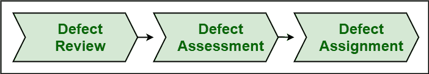

# 缺陷分类流程中的步骤

> 原文:[https://www . geeksforgeeks . org/缺陷分类步骤流程/](https://www.geeksforgeeks.org/steps-in-defect-triage-process/)

分流通常是一个医学术语，其含义是试验或试用。缺陷分类基本上是一个过程，在这个过程中，通常会筛选或评估所有问题，然后对其进行优先级排序，以确保以下事项:

*   这个问题是真的还是假的？
*   所有资源都得到了最有效的利用
*   维护和处理更健康的系统

缺陷分类会议的主要目的是简单地对缺陷进行分类或划分，区分优先级，并识别或跟踪问题或由这些缺陷引起的问题。

缺陷分类过程基本上有三个步骤，如下所示:

**1。缺陷评审:**
缺陷评审，顾名思义，就是对所有缺陷以及被团队拒绝的缺陷进行评审。在这种情况下，分类团队审查缺陷，以解决缺陷并最大限度地减少特定缺陷造成的损害。

**2。缺陷评估:**
缺陷评估，顾名思义，是指根据其特定的优先级和严重程度来评估缺陷。根据输入，缺陷被优先考虑。在这种情况下，分类团队决定这些缺陷是否重要，是要被解决或修复，还是保持等待以后解决缺陷，或者从列表中删除缺陷。

**3。缺陷分配:**
缺陷分配，顾名思义，就是将缺陷分配给正确的发布副产品经理。项目经理然后将缺陷重新导向正确的团队或所有者，以便采取进一步的行动。在对缺陷进行分析或评估后，将包含在“待修复”清单中的缺陷分配给相应的人员或部门。

**缺陷分类会议程序:**

1.  首先，质量保证团队发出一份缺陷或错误报告，以及自上次会议以来引入的所有新缺陷。
2.  Secondly, QA team then further calls for a meeting. Each defect is analyzed carefully during this meeting to see whether or not priority and severity are assigned to it correctly. If not, then are corrected for particular defects.

    根据严重程度，对这些缺陷进行分析和评估。

3.  第三，讨论了缺陷的复杂性，由缺陷引起的风险，解决缺陷所需的资源。
4.  此外，完成缺陷的评估、拒绝和重新分配。更新也在缺陷跟踪系统中被捕获或识别。