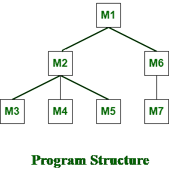

# 自上而下集成测试的步骤

> 原文:[https://www . geesforgeks . org/steps-in-top-down-integration-testing/](https://www.geeksforgeeks.org/steps-in-top-down-integration-testing/)

**自上而下测试**是一种增量式[集成测试](https://www.geeksforgeeks.org/software-engineering-integration-testing/)方法，通过架构结构的控制流，从上到下集成或连接两个或多个模块来完成测试。在这些中，首先测试高级模块，然后测试低级模块。然后，最后，完成集成以确保系统正常工作。存根和驱动程序被用来执行这个项目。该技术用于增加或刺激未集成到较低级别的模块的行为。

**加工:**
以下是加工过程中需要遵循的步骤:

1.  测试驱动程序代表主控制模块，也称为高级模块，存根通常用于所有直接从属于高级模块的低级模块。
2.  在这种情况下，测试从上到下进行。所以，还是先隔离测试高层模块。
3.  此后，低级模块或从属模块或存根一次一个地替换高级模块。这可以使用深度优先或广度搜索等方法来完成。
4.  重复该过程，直到每个模块被集成和测试。
5.  在完成每组测试后，另一个存根代替当前的真实或控制模块。这些存根作为被调用模块(存根)的临时替代，并给出与实际产品相同的结果或输出。
6.  为了检查是否有任何缺陷或任何错误发生或存在，回归测试已经完成，重要的是减少由于错误发生而可能引起的任何副作用。

**缺点:**
以下是自上而下集成测试中可能出现的一些逻辑问题:

1.  上层模型或高层模块应该进行适当的测试，以保持质量并处理低层模块或自顶向下测试的存根。
2.  我们知道，在这种类型的 pf 测试中，存根会临时替换较低级别的模块，但是数据不会随着这种替换而向上移动。因此，测试无法按时完成，导致测试延迟。
3.  由于更换，每次更换后存根可能会变得越来越复杂。
4.  在过程中可能出现的主要问题是无法控制特定测试和特定模块之间的对应关系。
5.  有时，较低级别的模块测试不充分(不令人满意，缺乏质量)。

**示例–**
在自顶向下的集成测试中，如果采用深度优先的方法，那么我们将从模块 M1 开始集成。然后我们将整合 M2，然后整合 M3、M4、M5、M6，最后整合 M7。

在自顶向下的集成测试中，如果采用广度优先的方法，那么我们将首先集成模块 M1，然后集成模块 M2、M6。然后我们将集成模块 M3，M4，M5，最后是 M7。

**优势:**

*   不需要写驱动。
*   接口错误在早期被识别，故障定位也更容易。
*   不重要的低级实用程序没有得到很好的测试，高级测试人员以适当的方式得到了很好的测试。
*   一旦添加了输入输出函数，测试用例的表示就变得更加容易和简单。

**缺点:**

*   它需要大量的存根和模拟对象。
*   在添加输入输出函数之前，用存根表示测试用例可能不容易，也可能很困难。
*   重要的低级实用程序也没有得到很好的测试。