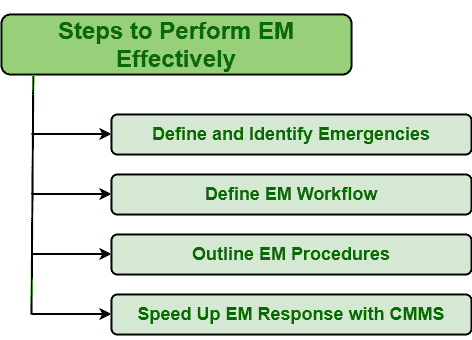

# 有效执行紧急维护的步骤

> 原文:[https://www . geeksforgeeks . org/执行步骤-紧急-维护-有效/](https://www.geeksforgeeks.org/steps-of-perform-emergency-maintenance-effectively/)

**紧急**顾名思义，是指会造成更大伤害的压力事件。任何类型的紧急情况都需要立即采取行动。紧急维护(EM)是一种维护措施，当任何紧急情况(即设备或资产故障)意外发生时，需要立即执行。执行 EM 是为了将资产恢复到其正常工作状态。

紧急维护通常旨在防止员工、技术人员、生产、产品质量、可靠性、盈利能力和组织生存能力的死亡。

**有效执行 EM 的步骤:**
执行 EM 很重要，也不是一件容易的事情。为了从电磁中获得最大的输出，需要一步一步有效地执行电磁。一个人应该始终遵循一些规则和程序以及协议，以最大限度地减少错误的机会，安全的风险，并提高工作速度。要有效地执行 EM，需要遵循四个主要步骤。这些步骤如下:

1.  **Define and Identify Emergencies :**
    One needs to understand what actually emergency means before proceeding towards any measures. Emergency is something that causes greater threat to life’s, system, production, etc. and therefore requires immediate action to be taken to minimize its impact. Not every failure or issue that occurs considered emergencies. One needs to able to differentiate between failures or breakdowns that are true emergencies and failures that are not emergencies. There can be two types of situations of failures as given below :
    *   **真正的紧急情况–**
        这些是非常关键的故障，会对系统造成更大的损害。这些故障需要在故障发生后立即处理，以便将其负面影响降至最低。这些失败被认为是真正的紧急情况。
    *   **非紧急情况–**
        这些故障不是关键故障，其原因不会对系统造成更大的损害。这些故障不需要在故障发生后立即解决，只要有可能，可以在以后解决。这些故障被视为非紧急情况。

    因此，对于一个人来说，理解、识别和定义真正的紧急情况下的失败是非常重要的，这样才能立即采取行动。它只是帮助组织更有效地处理情况，并管理对解决此类情况很重要的资源。

2.  **定义紧急维护工作流程:**
    在确定被视为紧急的故障后，第二步是定义如何实施紧急行动，关于其细节，它将如何结束。这些都是重要的点，应该记录下来。这些记录或工作流可以通过两种方式完成:
    *   **手动响应–**
        在该响应中，记录通常由员工创建，不涉及任何系统。
    *   **自动响应–**
        在这个响应中，记录通常是由系统创建的，没有任何人类的参与。
3.  **概述紧急维护程序:**
    定义 EM 工作流程后，下一步是确定程序，即执行紧急维护需要遵循的步骤。这些步骤如下:
    *   确定问题的根本原因。
    *   确定资产的现状。
    *   防止员工和所有工人受到其负面影响。
    *   收集执行环境管理所需的资源和工具。
    *   计划电磁过程
    *   执行 EM 流程。
4.  **加快 EM 响应与 CMMS :**
    [计算机化维护管理系统(CMMS)](https://www.geeksforgeeks.org/computerized-maintenance-management-systemcmms/) 被认为是加快维护流程的最佳方式之一。如果选择自动响应，CMMS 被认为是加速电磁最好的系统。CMMS 能够更快、更恰当地安排工作订单，还能帮助人们决定合适的技术人员来执行电磁操作。