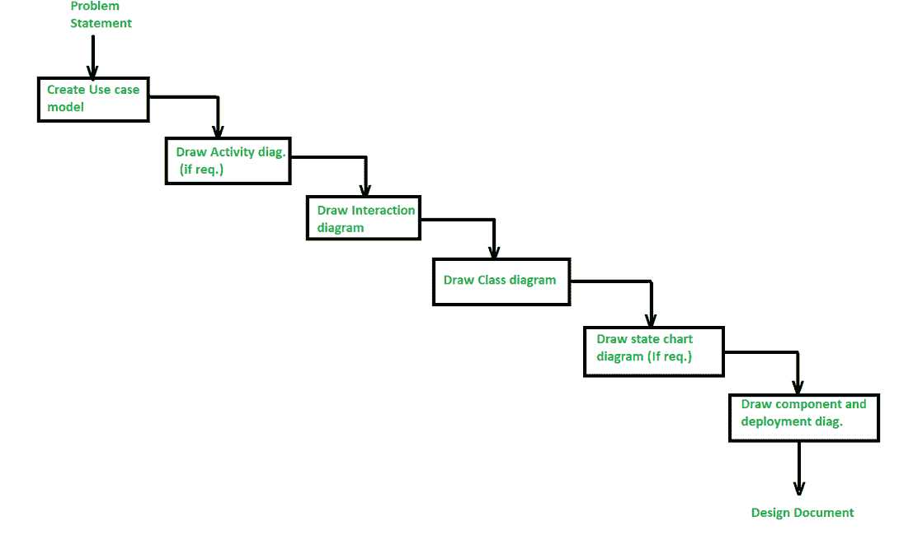
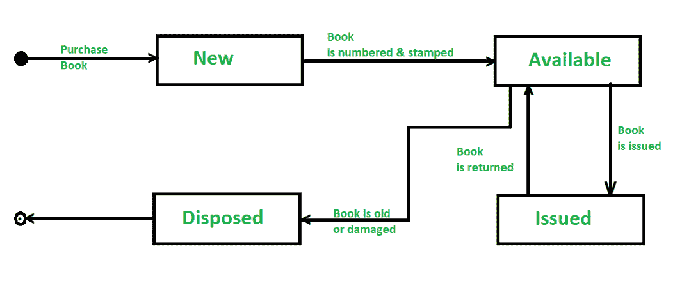

# 分析和设计面向对象系统的步骤

> 原文:[https://www . geesforgeks . org/面向对象系统的分析和设计步骤/](https://www.geeksforgeeks.org/steps-to-analyze-and-design-object-oriented-system/)

[**【面向对象分析(OOA)**](https://www.geeksforgeeks.org/object-oriented-analysis-and-design/) **:**
面向对象分析(OOA)是作为面向对象软件工程的一部分而执行的第一个技术活动。面向对象分析引入新概念来研究问题。

**面向对象设计(OOD) :**
使用面向对象分析创建的分析模型通过面向对象设计转换为设计模型，该设计模型作为软件创建的计划。面向对象的设计产生了具有几个不同模块化级别的设计，即主要的系统组件被划分为子系统(系统级的“模块化”)，并且它们的数据操作被封装到对象中(模块化的形式是面向对象系统的构造块)。).

面向对象系统分析和设计的步骤/阶段

在面向对象系统的分析和设计中有不同的步骤/阶段，如下图所示:

1.  **创建用例模型:**
    面向对象系统分析和设计的第一步是识别与系统相通的参与者。之后，创建用例并绘制用例图。

2.  **绘制活动图(如果需要):**
    活动图通过创建活动控制流来展示系统的动态特性。一项活动针对框架中某个类的过程，该过程导致系统条件的调整。下图显示了处理传递一些产品的请求的活动图。

3.  **Draw the interaction diagram :** 
    A interaction diagram shows a collaboration, comprising a bunch of articles and their relationship, including the messages that might be dispatched among them. Interaction diagram address the unique perspective on a system.

    **绘制交互图的步骤:**

    *   首先，我们应该区分每个用例的对象。
    *   然后我们为每个用例绘制序列图。
    *   然后我们为每个用例绘制协作图。

4.  **绘制类图:**类图负责展示类之间的关系。类图中有四种类型的关系:
    *   **联想–**
        是类与类之间的语义连接。当一个关联关联两个类时，每个类都可以按顺序或协作图向下一个类发送消息。它们可能是双向的，也可能是单向的。
    *   **依赖关系–**
        它们连接两个类，本质上总是单向的，并且显示一个类依赖于另一个类的定义。
    *   **聚合–**
        它们是一种更强的关联形式，显示了整体与部分之间的关系。
    *   **归纳–**
        它们用于显示两个类之间的继承关系。

5.  **状态图的设计:**
    状态图用于显示给定类的状态空间、影响从一个状态开始到下一个状态的进展的情况以及状态变化导致的活动。图书馆管理系统中“图书”的状态变化图如下所示:

6.**绘制组件和开发图:**
这些图解决了系统上的静态执行视角，它们用类图来标识，因为一个片段通常引导到至少一个类、接口或协同工作。