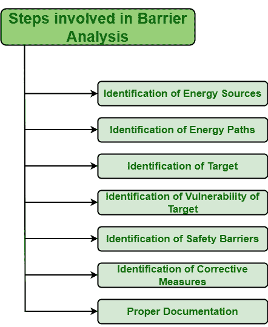

# 开展障碍分析的步骤

> 原文:[https://www . geesforgeks . org/steps-to-develop-barrier-analysis/](https://www.geeksforgeeks.org/steps-to-develop-barrier-analysis/)

[屏障分析](https://www.geeksforgeeks.org/Short-Note-on-Barrier-Analysis/)是用于识别未受保护的途径，或存在但有效(即不提供保护)的屏障和控制的过程。如果想要成功完成屏障分析，那么应该识别所有途径，即完整彻底地识别所有途径。

障碍分析的三个主要要素是目标、危害和障碍，这就是为什么障碍分析也被称为目标-危害-障碍分析。如果有人想要实现目标并希望成功完成分析，那么他/她需要遵循以下流程–

1.  **能量来源的识别:**
    首先，需要识别系统中所有可能影响目标的能量来源。其中一些能源不会造成任何伤害，但其中一些是有害的，会降低系统软件的整体质量。显然，这些有害的能源以一定的数量存在于特定的地点。因此，人们还需要确定这些来源的数量以及它们期望的位置。经鉴定，有害能源清单已编制完成。

*   **能量路径识别:**
    显然，识别出的有害能源会通过一些路径影响目标，即能量流动路径。因此，一个人需要识别所有可能的能量流动路径，通过这些路径，危险或有害源以负面方式影响目标。这里的目标可以是软件、产品、流程、人、物、环境等。*   **识别和定义目标:**
    当一个事件发生时，它对周围的任何事物都有一定的影响。当系统中存在有害能源时，就会对目标产生有害影响。这些目标可以不止一个。因此，人们需要充分关注并确定所有可能受到有害能源影响的目标。*   **目标脆弱性识别:**
    是的，目标会受到有害能源的影响。目标漏洞受有害来源的影响有多大，这取决于目标漏洞。这里的脆弱性仅仅意味着目标无法承受有害能源的影响。简而言之，需要确定和识别目标的脆弱性，即目标抵抗有害影响的能力。*   **安全栅的识别:**
    最基本的步骤之一就是安全栅的识别。并非所有类型的屏障都可以为特定目标提供安全。人们需要非常确定所提供的屏障是否有效，并防止目标来自有害能源。这种识别可以通过简单地比较有障碍的分析和无障碍的分析来完成。*   **纠正措施的识别:**
    如果所提供的屏障不能提供任何安全性或防止目标受到有害原因的影响，则应提供有效的屏障，以降低风险系数并为目标提供安全性。*   **适当的文档:**
    执行屏障分析后，需要记录识别和分析中涉及的所有步骤。这些文档对将来的分析很有用。