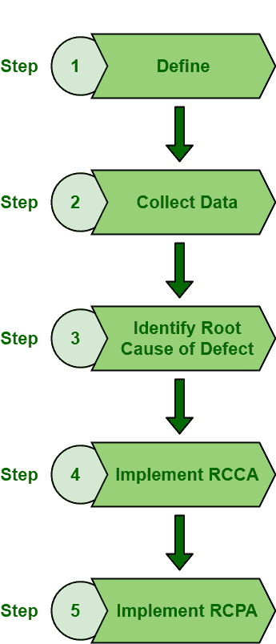

# 进行根本原因分析的步骤

> 原文:[https://www . geesforgeks . org/to-do-steps-根本原因分析/](https://www.geeksforgeeks.org/steps-to-do-root-cause-analysis/)

**[根本原因分析(RCA)](https://www.geeksforgeeks.org/basic-principle-of-root-cause-analysis/)** 基本上是更大的解决问题练习的一步。即使系统质量最好，系统也会出现问题或缺陷。解决缺陷或问题不是更大的问题。但是将来也会遇到一些缺陷或问题。因此，需要确定缺陷的真正原因。如果缺陷的根本原因没有被确定和解决，那么就有可能再次出现缺陷。因此，RCA 是识别根本原因(即缺陷的真正原因)非常重要和必需的工具。

**在 RCA 中要执行的步骤:**
为了进行有效的根本原因分析，需要结构和逻辑方法。RCA 中有几个步骤需要执行。这被认为是执行和记录驻地协调员评估的一般流程。这些步骤如下:

1.  **定义问题或缺陷:**
    定义缺陷仅仅意味着识别或确定系统中是否存在缺陷。它包括到底发生了什么，它的具体症状是什么，你观察到的问题是什么，它的严重性，等等。

*   **收集关于缺陷的数据:**
    收集数据简单来说就是收集关于缺陷的所有信息和数据。它必须包括它的影响，缺陷存在的证据，缺陷存在了多长时间，它是否是一个重复出现的缺陷。还应该与客户或员工沟通。在确定根本原因之前，需要全面分析缺陷或问题。人们需要收集所有需要的信息或证据。*   **识别缺陷的根本原因:**
    识别根本原因简单来说就是识别导致缺陷产生的主要原因。它必须包括缺陷为什么存在，以及它存在的主要原因是什么。现在有几种工具可以用来识别缺陷的根本原因。一个人需要选择正确的工具，这将导致有效的结果。为了确定根本原因，头脑风暴会议也应该在会议期间进行。它基本上是一种通过各种努力来定义特定问题或缺陷的技术。缺陷的根本原因可能不止一个。因此，我们需要找出尽可能多的原因。*   **实施根本原因纠正措施(RCCA) :**
    确定根本原因后，采取一些措施和行动来解决或消除缺陷。主要的焦点应该是消除问题或缺陷的根本原因，以便将来不再发生。需要确定一些需要采取的有效措施和纠正措施。在选择任何方法之前，确保它不会导致任何其他副作用或系统问题。*   **实施根本原因预防行动(RCPA) :**
    需要制定一些关于缺陷再次发生的计划。缺陷不应在未来再次发生，因此，一个人需要提高技能，以适当的方式执行任务，遵循适当的预防措施文件。