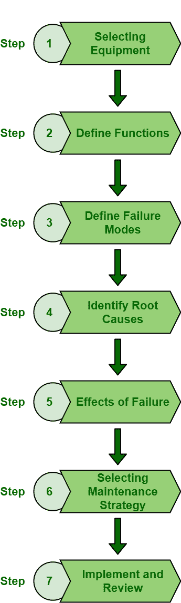

# 执行 RCM 的步骤

> 原文:[https://www.geeksforgeeks.org/steps-to-perform-rcm/](https://www.geeksforgeeks.org/steps-to-perform-rcm/)

[以可靠性为中心的维护(RCM)](https://www.geeksforgeeks.org/types-of-rcm-approaches/) 是一个过程，通常用于优化维护程序，只是为了保持系统的可靠性和功能。RCM 在各种类型的行业中应用更为广泛。我们知道，在某些时候，设备和机械或系统会发生故障。因此，需要获得合适的维护策略。这种维护策略将有助于确定最大的故障概率、所有可能的故障原因，然后最终确定节省成本和时间的解决方案或方法，以保护系统免受这些故障的影响。

**RCM 流程:**
RCM 流程分以下七个步骤完成:

1.  **选择设备:**
    首先需要选择一个资产，即设备、流程、系统等。这需要分析。这种选择应基于其严重性、先前维修所需的成本、维护成本以及对整体生产和质量的影响。在分析了所有这些因素后，可以选择合适的资产进行风险控制管理分析。

*   **定义功能:**
    其次，需要定义所选设备的功能。人们应该知道系统是如何工作的，以便能够相应地处理它。一个系统包含许多设备，因此了解所选设备的功能至关重要，以便选择合适的维护策略。*   **定义故障模式:**
    第三，需要确定所选设备和系统发生故障的不同方式。定义故障模式应该是主要目标之一，这样人们就可以在故障发生之前确定保护故障的方法。*   **查明根本原因:**
    第四，需要查明此类故障的主要原因，以便能够永久消除故障。根本原因是此类故障发生的主要原因。有必要确定故障的主要原因，以便识别和实施有效的解决方案和维护策略，从而永久消除故障。可以使用操作员、经验丰富的技术人员、RCM 团队、专家等来确定根本原因。*   **故障的影响:**
    故障对系统的影响会更大。它会影响系统或设备的设计、质量、工艺或应用。失败从其根本原因开始，然后导致一个特定的最终结果。识别故障如何影响系统、生产和总成本是非常重要的。在故障发生之前确定故障的关键程度是非常必要的。有多种技术可用于识别故障的影响，如下所示:
    *   故障模式和影响分析(FMEA)。
    *   危险和可操作性研究。
    *   故障树分析等。*   **选择维修策略:**
    这一步非常关键和重要。确定维护策略是保存故障的唯一方法，因此选择适当的维护策略非常重要，该策略必须具有成本效益和可靠性，并且在技术上可行。有两种维护策略，即基于条件的维护和基于使用的预防性维护。相应地选择维护策略。如果任何故障模式没有任何维护选项，那么唯一能做的就是重新设计系统，以消除和修改故障模式。*   **实施和评审:**
    RCM 是一个需要持续改进和维护的过程。因此，在实施维护策略后，应定期进行审查和检查，并进行持续改进。应定期审查，以便实施新的更新。