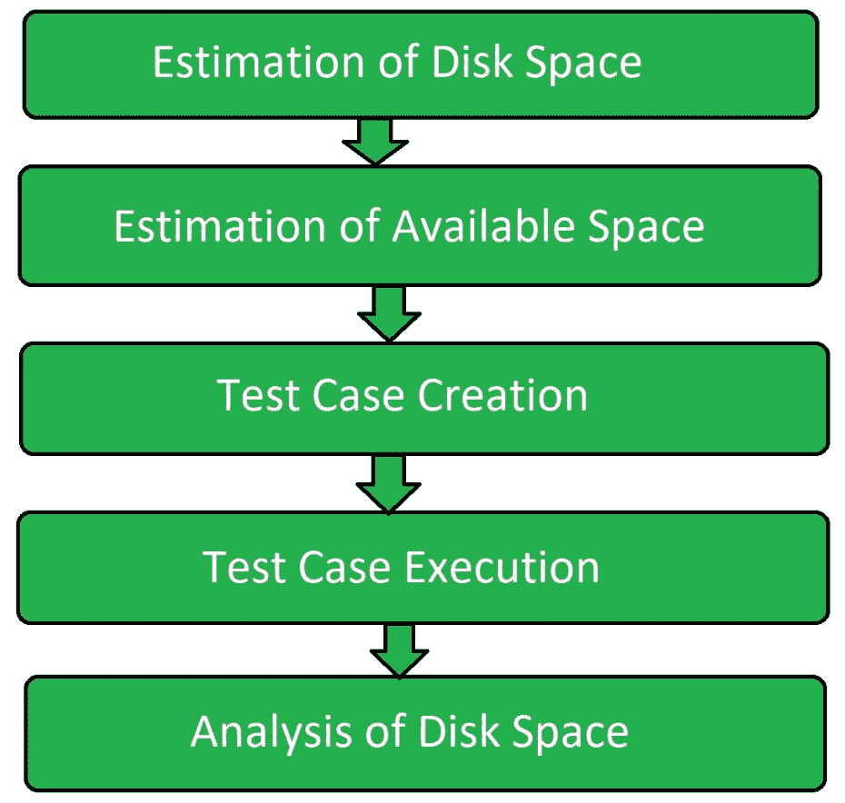

# 存储软件测试

> 原文:[https://www.geeksforgeeks.org/storage-software-testing/](https://www.geeksforgeeks.org/storage-software-testing/)

存储测试是[软件测试](https://www.geeksforgeeks.org/software-testing-basics/)的一种类型，执行该测试是为了验证软件是否将相关数据存储在适当的目录中，并且有足够的空间来防止由于磁盘空间不足而导致的意外终止，即堆栈溢出。

存储测试基本上是在对软件进行测试的地方进行的，以查看软件是否在正确的目录中存储和读取数据文件，并测试是否有足够的空间，以便不会由于堆栈溢出而发生意外终止。

**存储测试的目标:**
存储测试的目标是:

*   部署前确定实际存储限制。
*   确定更换新硬件设备或升级任何现有设备时的系统行为。
*   尽量缩短响应时间。
*   要抓紧加工。

**存储测试流程:**
存储测试分为以下不同步骤进行:

**磁盘空间估计:**
首先评估总磁盘空间。测试人员知道系统的整个内存，以便执行进一步的步骤。

**可用空间估算:**
现在估算并观察总占用和可用空间。测试人员开始知道总空间中有多少被占用，有多少是空闲的。

**测试用例创建:**
在估算可用内存空间后，根据最终用户需求设计测试用例。测试用例的创建是基于软件的不同功能来完成的。

**测试用例执行:**
在估计磁盘空间和创建测试用例之后，执行测试过程的主要步骤，即测试用例执行。在前一阶段生成的测试用例在这个阶段执行。

**磁盘空间分析:**
测试用例执行后，估算测试用例执行过程中消耗的总磁盘空间。现在的分析是基于估计的空间和实际消耗的空间。

**储存测试类型:**

*   **应用测试:**
    进行响应时间和运行时间的分析。
*   **应用模拟:**
    测试流程执行的峰值存储。
*   **基准测试:**
    测试数据是否损坏。