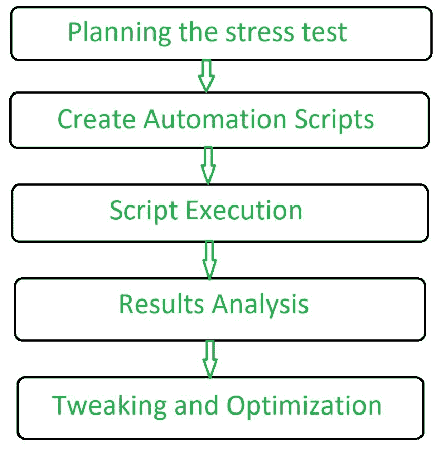

# 压力测试|软件测试

> 原文:[https://www . geesforgeks . org/压力测试-软件-测试/](https://www.geeksforgeeks.org/stress-testing-software-testing/)

先决条件–[软件测试的类型](https://www.geeksforgeeks.org/types-software-testing/)
**压力测试**是一种软件测试技术，通过测试超出正常运行的极限来确定软件的健壮性。压力测试对于关键软件尤其重要，但适用于所有类型的软件。压力测试强调的是重载下的健壮性、可用性和错误处理，而不是正常情况下的正确行为。

压力测试被定义为一种验证系统稳定性和可靠性的软件测试。该测试特别确定了系统在极端重载条件下的鲁棒性和错误处理。它甚至在正常工作点之外进行测试，并分析系统在极端条件下如何工作。进行压力测试是为了确保系统不会在紧急情况下崩溃。压力测试也被称为*或 ***折磨测试*** 。*

***压力测试特点:***

1.  *压力测试分析系统故障后的行为。*
2.  *压力测试确保系统在故障后恢复。*
3.  *它检查系统是否在异常条件下工作。*
4.  *它确保在系统处于压力下时显示适当的错误信息。*
5.  *它验证意外故障不会导致安全问题。*
6.  *它验证系统在崩溃前是否保存了数据。*

***压力测试流程:***

**

***压力测试类型:***

1.  ****服务器-客户端压力测试* :**
    在这个压力测试中，从服务器开始对所有客户端进行测试。*
2.  ****产品压力测试* :**
    产品压力测试专注于发现软件产品中与数据锁定和阻塞、网络问题和性能拥塞相关的缺陷。*
3.  ****交易压力测试* :**
    交易压力测试是对两个或多个应用之间的一个或多个交易进行的。它的执行是为了微调和优化系统。*
4.  ****系统压力测试* :**
    系统压力测试是集成测试，用于在同一台服务器上运行的多个系统之间进行测试。它用于发现一个应用程序数据阻塞另一个应用程序的缺陷。*
5.  ****【解析压力测试】* :**
    解析压力测试是对真实场景中不太可能发生的参数或条件异常的系统进行测试。它的执行是为了在不寻常的场景中发现缺陷，比如大量用户同时登录，或者数据库在从网站访问时离线。*

***压力测试工具:***

*1.[Jmeter](http://jmeter.apache.org/)T2【2】。[加载转轮](http://www.hp.com/)T5】3。应力测试仪
4。新载荷*

***压力测试的优势:***

*1.压力测试决定系统故障后的行为，确保系统快速恢复。
2。压力测试确保系统故障不会导致安全问题。
3。压力测试使系统以适当的方式在正常和异常条件下工作。*