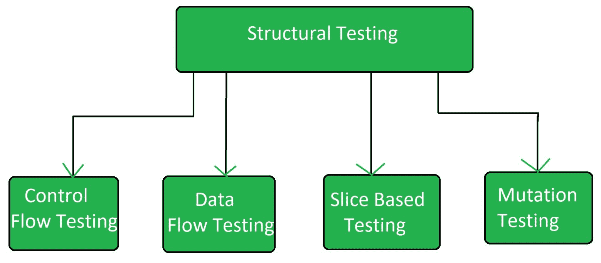

# 结构软件测试

> 原文:[https://www.geeksforgeeks.org/structural-software-testing/](https://www.geeksforgeeks.org/structural-software-testing/)

**结构测试**是[软件测试](https://www.geeksforgeeks.org/software-testing-basics/)的一种类型，它使用软件的内部设计进行测试，或者换句话说，由知道软件开发阶段的团队执行的软件测试，称为结构测试。

结构测试基本上与软件的内部设计和实现相关，即它涉及测试团队中的开发团队成员。它基本上根据软件的类型测试软件的不同方面。结构测试与行为测试正好相反。

**结构测试类型:**
结构测试有 4 种类型:

**控制流测试:**
控制流测试是一种以程序的控制流为模型的结构测试。对于这种类型的测试，必须知道软件的整个代码、设计和结构。开发人员经常使用这种类型的测试来测试他们自己的代码和实现。此方法用于测试代码的逻辑，以便获得所需的结果。

**数据流测试:**
它利用控制流图来探索数据可能发生的不合理的事情。
数据流异常的检测基于值和变量之间的关联。不用初始化变量的用法。初始化的变量不会使用一次。

**基于切片的测试:**
最初是魏泽和加拉格尔为了软件维护而提出的。它对软件调试、软件维护、程序理解和功能内聚性的量化都很有用。它将程序分成不同的部分，并测试对整个软件有重大影响的部分。

**突变测试:**
突变测试是软件测试的一种类型，它被执行来设计新的软件测试，并且还评估已经存在的软件测试的质量。变异测试与小规模修改程序有关。它的重点是帮助测试人员开发有效的测试，或者找出程序使用的测试数据中的弱点。

**结构测试的优势:**

*   它提供了软件的全面测试。
*   它有助于在早期发现缺陷。
*   它有助于消除死代码。
*   这并不耗时，因为它大部分是自动化的。

**结构测试的缺点:**

*   执行测试需要代码知识。
*   它需要测试工具的培训。
*   有时候很贵。

**结构测试工具:**

*   JBehave
*   黄瓜
*   Junit
*   断续器