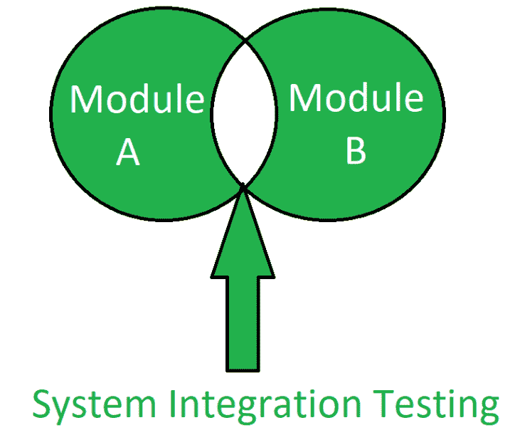

# 系统集成(软件)测试(SIT)

> 原文:[https://www . geesforgeks . org/system-integration-software-testing-sit/](https://www.geeksforgeeks.org/system-integration-software-testing-sit/)

**系统集成测试(SIT)** 是[软件测试](https://www.geeksforgeeks.org/software-testing-basics/)的类型，它是为了对由许多集成组件组成的完整系统进行整体测试而进行的。执行 SIT 的系统可能具有不同的硬件部分、不同的软件部分或硬件和软件。

SIT 是以合理且符合逻辑的方式构建系统组成部分的过程。SIT 以更低的成本执行测试。它检查系统的全部功能。系统测试包含在 SIT 中，SIT 是验证系统是否满足要求的过程，它测试系统是否按照用户的要求运行。

在开发阶段，系统集成测试是系统组装后执行的第一个测试过程。SIT 也可以被定义为一个测试过程，它练习一个软件系统与其他系统的共存。它涉及多个集成系统，并且假设每个系统都已经通过了系统集成测试。执行 SIT 是为了测试几个集成组件之间的交互。

> SIT 是一种*黑盒测试*技术。

**系统集成测试的目标:**
SIT 的目标是:

*   满足用户需求的软件。
*   最大化内存使用。
*   控制系统内的数据流。
*   测试系统的控制流程。
*   找出系统中的错误和缺陷。
*   尽量减少测试过程的时间消耗。

**SIT 的主要状态:**
系统集成测试有三个主要状态:

1.  **集成层内的数据状态:**
    集成层是用于数据转换的媒介。不同的 web 服务被包含在这个层中，它被用作数据发送和接收的媒介。有几个检查数据有效性的检查点，其中使用了几个协议。
    中间件还被用作转换的媒介，允许数据映射到交叉检查。
2.  **数据库层内的数据状态:**
    数据库层由几个步骤组成。它检查数据是否从集成层转换到数据库层。检查数据属性并执行数据验证过程。主要用于数据存储和数据操作过程。
3.  **应用层内的数据状态:**
    应用层用于为数据库创建数据图，并检查其与用户界面的交互。数据属性也会被检入其中。