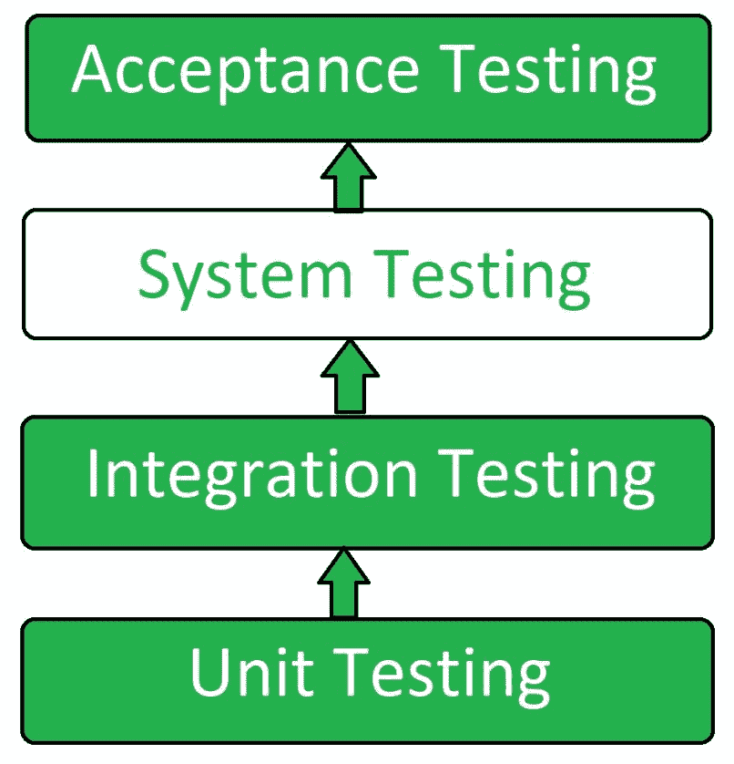
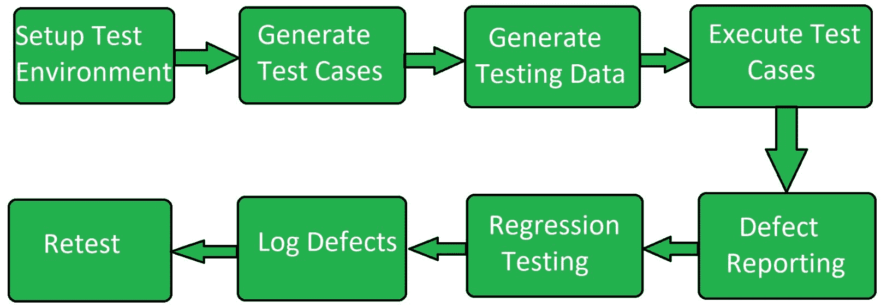

# 系统测试

> 原文:[https://www.geeksforgeeks.org/system-testing/](https://www.geeksforgeeks.org/system-testing/)

**系统测试**是一种[软件测试](https://www.geeksforgeeks.org/software-testing-basics/)，在一个完整的集成系统上执行，以评估系统是否符合相应的要求。

在系统测试中，集成测试通过的组件作为输入。集成测试的目标是检测集成在一起的单元之间的任何不规则性。系统测试检测集成单元和整个系统中的缺陷。系统测试的结果是组件或系统在测试时观察到的行为。

**系统测试**是在系统需求规格或功能需求规格或两者的背景下对整个系统进行的。系统测试测试系统的设计和行为，以及客户的期望。执行该测试是为了测试超出[软件需求规范](https://www.geeksforgeeks.org/software-engineering-quality-characteristics-of-a-good-srs/)中所述范围的系统。

系统测试基本上是由独立于开发团队的测试团队来执行的，开发团队帮助公正地测试系统的质量。它有功能测试和非功能测试。

**系统测试是黑盒测试**。

系统测试在集成测试之后和验收测试之前进行。

**系统测试流程:**
系统测试按以下步骤进行:

*   **测试环境设置:**
    为更好的质量测试创建测试环境。
*   **创建测试用例:**
    为测试过程生成测试用例。
*   **创建测试数据:**
    生成要测试的数据。
*   **执行测试用例:**
    生成测试用例和测试数据后，执行测试用例。
*   **缺陷报告:**
    检测到系统中的缺陷。
*   **回归测试:**
    进行是为了测试测试过程的副作用。
*   **日志缺陷:**
    缺陷在此步骤中修复。
*   **重新测试:**
    如果测试不成功，则再次进行测试。

**系统测试类型:**

*   **性能测试:**
    性能测试是一种软件测试，用于测试软件产品或应用程序的速度、可扩展性、稳定性和可靠性。
*   **负载测试:**
    负载测试是一种软件测试，用于确定系统或软件产品在极端负载下的行为。
*   **压力测试:**
    压力测试是一种软件测试，用于检查系统在不同负载下的健壮性。
*   **可伸缩性测试:**
    可伸缩性测试是一种软件测试，用于检查软件应用程序或系统的性能，看其是否能够扩大或缩小用户请求负载的数量。